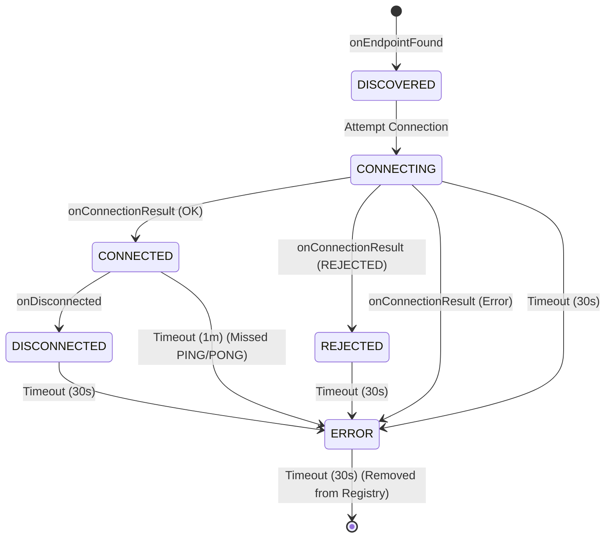

# GEMINI Project Analysis: SimpleMesh

## Project Overview

This is an Android application named "SimpleMesh" that tests device-to-device communication using
Google Play Services Nearby Connections API.

## PRIMARY DIRECTIVE: NO ACTION WITHOUT EVIDENCE AND APPROVAL.

There is one PRIMARY DIRECTIVE that is more important than everything else:
**GATHER PROOF BEFORE DECIDING ON A COURSE OF ACTION.**

1. Gemini should never try a code change without first gathering **conclusive evidence** that the
   bug is fully understood, couldn't possibly be caused by something else, and the suggested fix is
   the best possible way to resolve the issue.
2. The bug MUST be logged in BUGS.md along with the evidence and best possible proposed resolution.
3. This course of action (proof + solution) must be discussed with the user and the fix agreed on
   before editing code. This is intentionally a very high bar before starting coding, but it must
   avoid "random attempts at fixing bugs" that have been a constant issue in the past.
4. The user MUST agree to the fix before you edit files.

## Modern Kotlin Development

* **Kotlin 2.x:** Leverage the latest features and syntax from Kotlin 2.x to write concise and
  efficient code.
* **Fluent and Expressive Code:** Strive for code that reads like natural language. Use higher-order
  functions and extension functions to create fluent and expressive APIs.
* **Safety and Immutability:** Prioritize null safety by using nullable types (`?`) and the `?.` and
  `?:` operators. Favor immutable data structures (`val`, `listOf`, `mapOf`) to prevent unintended
  side effects.
* **Structured Concurrency:** Use coroutines for all asynchronous operations. Follow structured
  concurrency principles to ensure that coroutines are launched in a specific scope and are
  automatically cancelled when the scope is cancelled. This prevents resource leaks and simplifies
  error handling.
* **Kotlin Time:** Use `kotlin.time.Duration` for all time-related values. It provides a type-safe
  and readable way to represent durations, avoiding ambiguity and potential errors from using raw
  numeric types.
* **2025 Coding Standards:** Adhere to modern coding standards, including:
    * Using the latest stable versions of libraries and tools.
    * Following the official Kotlin coding conventions.
    * Writing unit tests for all new code.
    * Using a linter to enforce code style and catch potential errors.

## Separation of Concerns

* **`MainActivity.kt`**: The entry point of the application. Its primary role is to request
  necessary permissions and set up the UI. It initializes and coordinates the `MainViewModel` and
  `NearbyConnectionsManager`.

* **`MainViewModel.kt`**: Acts as a bridge between the `NearbyConnectionsManager` and the UI. It
  holds the device list as a `StateFlow` observed by the UI, ensuring the screen always displays the
  latest device states.

* **`DevicesRegistry.kt`**: A singleton object that serves as the single source of truth for the
  state of all discovered devices. It maintains a map of `endpointId` to `DeviceState`.

* **`DeviceState.kt`**: A data class representing the state of a single remote device. It includes
  the device's name, endpoint ID, and current `ConnectionPhase`. Crucially, it manages its own
  lifecycle through a timeout mechanism. When a device enters a new phase, a coroutine is launched
  to transition it to the next phase (or remove it) if it remains in the current phase for too long.

* **`ConnectionPhase.kt`**: An enum that defines the possible states of a connection (e.g.,
  `DISCOVERED`, `CONNECTING`, `CONNECTED`, `REJECTED`). Each phase has an associated timeout and a
  designated next phase upon timeout, which drives the state machine.

* **`NearbyConnectionsManager.kt`**: The core of the application's logic. It handles all
  interactions with the Google Play Services Nearby Connections API, including:
    * "Successful" state transitions: transitions made when something positive happens. This is the
      flip side to the ConnectionPhase's timeout transitions, which are normally for error states.
    * Starting and stopping device discovery and advertising.
    * Initiating, accepting, and rejecting connections.
    * Sending and receiving data (payloads), specifically the `PING` and `PONG` messages for
      heartbeats.
    * Updating the `DevicesRegistry` based on connection lifecycle events.

## Architectural Overview

This application implements a multi-hop mesh network on top of the Google Nearby Connections API.
The core challenge is that the API's `Strategy.P2P_CLUSTER` provides only 1-hop primitives and is
limited to 3-4 simultaneous Bluetooth connections. To overcome this, the application builds a
sophisticated application-layer protocol to manage a 30+ node network.

### Key Architectural Components

* **Connection Manager**: Handles the core API callbacks, authentication, and retries with
  exponential backoff.
* **Liveness Manager**: Implements an application-layer PING/PONG heartbeat to detect and remove "
  zombie" connections.
* **Topology Manager**: Uses a gossip protocol to build and maintain a complete map of the network
  graph.
* **Connection Slot Manager**: Intelligently selects which peers to connect to, prioritizing graph
  health and avoiding partitions.
* **Routing Engine**: Implements a custom `MeshPayload` for network-wide flooding (broadcast) and
  source-routing (unicast).
* **Healing Service**: Implements local and global healing strategies to repair the network in
  response to node churn and partitions.

## Implemented Features

This application has been verified to include the following features:

* **Sparse Graph Topology**: The application limits the number of concurrent connections to four per
  device to prevent connection floods.
* **Application-Layer Routing**: Payloads are wrapped in a custom header and routed through the
  network using a flooding mechanism.
* **Partition Recovery**: The app implements a PING/PONG heartbeat to detect and handle "zombie"
  connections, and connection rotation to prevent network islands.
* **Persistent Identity**: The application uses a persistent UUID to identify devices, avoiding the
  ephemeral `endpointId`.
* **Bandwidth Conservation**: Payloads are kept small, and the app avoids using `STREAM` payloads.
* **Connection Flux Handling**: The application gracefully handles disconnections by removing the
  node from the routing table and triggering a re-scan if necessary.

---

# Detailed Network State Flow & Lifecycle

This section outlines the lifecycle of nodes in the mesh, specifically focusing on the **Random "
Cockroach" Strategy**. It details how nodes connect, handle rejection, and how the network attempts
to merge partitions.

Code references are provided in brackets, e.g., `[File.kt :: functionName]`.

## 1. State Machine Reference

The `DeviceState` tracks the status of a remote peer. Transitions are triggered by API callbacks (
Found, Connected, Disconnected) or automatic Timeouts.

### Timeout Table

Defined in `ConnectionPhase.kt`.

| State            | Timeout  | Behavior on Timeout | Notes                                            |
|:-----------------|:---------|:--------------------|:-------------------------------------------------|
| **DISCOVERED**   | Infinite | None                | Stays visible until connected or lost.           |
| **CONNECTING**   | 30 sec   | -> **ERROR**        | Guards against stuck handshakes.                 |
| **CONNECTED**    | 1 min    | -> **ERROR**        | Liveness check (PING/PONG) failed.               |
| **DISCONNECTED** | 30 sec   | -> **ERROR**        | Grace period after disconnect.                   |
| **REJECTED**     | 30 sec   | -> **ERROR**        | Grace period after rejection.                    |
| **ERROR**        | 30 sec   | -> **Removed**      | Final cleanup. **Risk: Node becomes invisible.** |

### State Diagram

## 2. Scenario 1: Bootstrapping the Mesh (Happy Path)

**Actors:** NodeA (Empty), NodeB (Empty).
**Goal:** Form a 1-hop mesh.

1. **Start:** Both nodes start `NearbyConnectionsManager`.
    * `[NearbyConnectionsManager.kt :: startDiscovery]`
    * `[NearbyConnectionsManager.kt :: startAdvertising]`
2. **Discovery:**
    * NodeA finds NodeB. `onEndpointFound` fires.
      `[NearbyConnectionsManager.kt :: endpointDiscoveryCallback]`
    * NodeA Registry: NodeB is **DISCOVERED**. `[DevicesRegistry.kt :: updateDeviceStatus]`
    * NodeA Strategy: Adds NodeB to `potentialPeers`. `[DevicesRegistry.kt :: addPotentialPeer]`
3. **Selection:**
    * NodeA's `RandomConnectionStrategy` loop wakes up.
      `[RandomConnectionStrategy.kt :: manageConnectionsLoop]`
    * Checks capacity: 0/4 (OK).
    * Picks NodeB (randomly or by retry count). `[RandomConnectionStrategy.kt :: attemptToConnect]`
4. **Connection Request:**
    * NodeA updates NodeB state to **CONNECTING**. `[DevicesRegistry.kt :: updateDeviceStatus]`
    * NodeA calls `requestConnection("SimpleMesh", NodeB)`.
      `[RandomConnectionStrategy.kt :: connectToPeer]`
5. **Handshake:**
    * NodeB receives `onConnectionInitiated`.
      `[NearbyConnectionsManager.kt :: connectionLifecycleCallback]`
    * NodeB Strategy: Checks capacity 0/4 (OK). **Accepts** connection.
      `[RandomConnectionStrategy.kt :: onConnectionInitiated]`
    * NodeA receives `onConnectionInitiated`. **Accepts** connection.
6. **Success:**
    * Both receive `onConnectionResult(STATUS_OK)`.
      `[NearbyConnectionsManager.kt :: connectionLifecycleCallback]`
    * State updates to **CONNECTED**.
    * `DevicesRegistry` resets retry count for the peer. `[DevicesRegistry.kt :: resetRetryCount]`
7. **Liveness:**
    * NodeA immediately sends `PING` payload. `[NearbyConnectionsManager.kt :: connectedSendPing]`
    * NodeB receives `PING`. `[NearbyConnectionsManager.kt :: payloadCallback]`
    * NodeB updates state to **CONNECTED** (refreshing timeout).
      `[DevicesRegistry.kt :: updateDeviceStatus]`
    * NodeB replies `PONG`. `[NearbyConnectionsManager.kt :: payloadCallback]`
    * NodeA receives `PONG`, updates state, schedules next `PING` in 30s.

## 3. Scenario 2: Handling Rejection (Capacity Reached)

**Actors:** NodeA (Full, 4 peers), NodeE (Newcomer).
**Goal:** NodeE attempts to join but is rejected.

1. **Discovery:** NodeE finds NodeA. State: **DISCOVERED**.
   `[NearbyConnectionsManager.kt :: endpointDiscoveryCallback]`
2. **Attempt:** NodeE Strategy sees NodeA as a candidate. Updates to **CONNECTING** and requests
   connection. `[RandomConnectionStrategy.kt :: connectToPeer]`
3. **Rejection Logic:**
    * NodeA receives `onConnectionInitiated`.
      `[NearbyConnectionsManager.kt :: connectionLifecycleCallback]`
    * NodeA Strategy: Checks capacity. 4/4 (Full).
    * NodeA calls `rejectConnection`. `[RandomConnectionStrategy.kt :: onConnectionInitiated]`
    * NodeA logs warning: "Rejecting... Capacity Reached".
4. **Outcome for NodeE:**
    * NodeE receives `onConnectionResult(STATUS_CONNECTION_REJECTED)`.
      `[NearbyConnectionsManager.kt :: connectionLifecycleCallback]`
    * NodeE updates NodeA state to **REJECTED**. `[DevicesRegistry.kt :: updateDeviceStatus]`
    * **Retry Logic:** NodeE increments `retryCount` for NodeA (persisted by name).
      `[DevicesRegistry.kt :: incrementRetryCount]`
5. **The "Trap" (Wait Period):**
    * NodeE's `DeviceState` for NodeA is **REJECTED**.
    * NodeE waits 30 seconds (Timeout). `[DeviceState.kt :: startAutoTimeout]`
    * State becomes **ERROR**.
    * NodeE waits 30 seconds (Timeout).
    * State becomes **null** (Removed from Registry). `[DeviceState.kt :: startAutoTimeout]`
6. **Ghost Node Recovery:**
    * NodeA is removed from NodeE's `DevicesRegistry`. `[DevicesRegistry.kt :: remove]`
    * NodeE's `NearbyConnectionsManager` observes the removal via `DevicesRegistry.devices` flow.
      `[NearbyConnectionsManager.kt :: init]`
    * **Action:** NodeE triggers `stopDiscovery()` then `startDiscovery()`.
    * **Result:** The underlying API cache is flushed. If NodeA is still visible, `onEndpointFound`
      fires again.
    * NodeE re-discovers NodeA as **DISCOVERED**. Cycle repeats (but with backoff due to retry
      count).

## 4. Scenario 3: Split Brain & Island Merging

**Actors:** Cluster 1 (Nodes A, B, C, D - Full), Cluster 2 (Nodes E, F, G, H - Full).
**Goal:** The two clusters merge.

*Context: Both clusters are saturated (4 connections per node). Nodes in Cluster 1 can see Nodes in
Cluster 2, but cannot connect because they are full.*

1. **Stalemate:**
    * NodeA sees NodeE.
    * NodeA is full. Strategy skips `attemptToConnect`.
      `[RandomConnectionStrategy.kt :: manageConnectionsLoop]`
    * NodeE is full. Strategy skips `attemptToConnect`.
    * Network is partitioned (Split Brain).
2. **The "Cockroach" Island Breaker:**
    * NodeA's Strategy loop runs.
    * Condition: `activeConnections >= MAX_CONNECTIONS` (True).
      `[RandomConnectionStrategy.kt :: manageConnectionsLoop]`
    * Dice Roll: `Random.nextDouble() < 0.1` (10% chance).
      `[RandomConnectionStrategy.kt :: considerIslandBreaking]`
    * **Action:** NodeA disconnects a random peer (e.g., NodeD).
      `[ConnectionsClient.disconnectFromEndpoint]`
3. **Opening a Slot:**
    * NodeA state for NodeD -> **DISCONNECTED**. `[NearbyConnectionsManager.kt :: onDisconnected]`
    * NodeA active connections: 3/4.
4. **Merge Opportunity:**
    * Next Strategy loop (after ~5s). `[RandomConnectionStrategy.kt :: manageConnectionsLoop]`
    * NodeA capacity: 3/4 (Available).
    * NodeA sees NodeE in `potentialPeers` (DISCOVERED).
    * NodeA initiates connection to NodeE. `[RandomConnectionStrategy.kt :: connectToPeer]`
5. **Handshake (Half-Open):**
    * NodeE receives request.
    * **Risk:** If NodeE is still full (4/4), it will **REJECT** NodeA.
    * **Success:** If NodeE *also* ran its Island Breaker recently, or has a slot, it accepts.
6. **Stabilization:**
    * If connected, the islands are bridged.

## 5. Scenario 4: Error Recovery (The Zombie Node)

**Actors:** NodeA, NodeB.
**Event:** NodeB walks out of range or crashes without sending a disconnect frame.

1. **Silence:** NodeA is **CONNECTED** to NodeB.
2. **Liveness Check:**
    * NodeA sends `PING`. Fails (or sends into void).
      `[NearbyConnectionsManager.kt :: connectedSendPing]`
    * NodeB does not reply `PONG`.
3. **Timeout:**
    * NodeA's `DeviceState` timer (1 minute) expires. `[DeviceState.kt :: startAutoTimeout]`
    * Callback: `phaseOnTimeout` returns **ERROR**. `[ConnectionPhase.kt]`
    * NodeA updates NodeB state to **ERROR**.
4. **Cleanup:**
    * NodeA waits 30 seconds in **ERROR**.
    * Timeout expires. Returns `null`.
    * NodeA calls `DevicesRegistry.remove(NodeB)`. `[DevicesRegistry.kt :: remove]`
5. **Re-Discovery:**
    * NodeB is removed from internal maps.
    * NodeA's manager observes removal. `[NearbyConnectionsManager.kt :: init]`
    * **Action:** NodeA restarts Discovery.
    * **Result:** If NodeB comes back online or moves back in range, it is re-discovered fresh.

## 6. Scenario 5: Atomic Connection Failure

**Actors:** NodeA, NodeB.
**Event:** NodeA tries to connect, but the request fails immediately (e.g., radio busy, internal
error).

1. **Attempt:** NodeA calls `requestConnection`. `[RandomConnectionStrategy.kt :: connectToPeer]`
2. **Immediate Failure:** The API call fails before the handshake starts.
    * The `addOnFailureListener` block executes.
3. **Fail Fast:**
    * NodeA immediately updates NodeB state to **ERROR**.
      `[RandomConnectionStrategy.kt :: connectToPeer]`
    * *Previously, this would wait 30s in CONNECTING.*
4. **Cleanup:**
    * NodeB enters **ERROR** state (30s timeout).
    * Timeout expires -> Removed.
    * Removal triggers **Restart Discovery** (Scenario 2/4).

---

# Future Refactoring & Hardening Plan ("The 25% Better")

This document outlines a focused effort to improve the stability, architecture, and testability of
the SimpleMesh application without increasing feature scope.

## 1. Robustness & Lifecycle (Critical Fixes)

### 1.1 Fix Activity Lifecycle Leak

**Severity:** Critical
**Problem:**
`NearbyConnectionsManager` is currently initialized in `MainActivity` using `lifecycleScope`. When
the screen rotates or the Activity is recreated:

1. `lifecycleScope` is cancelled.
2. The `externalScope` inside `NearbyConnectionsManager` becomes cancelled.
3. All background P2P operations (discovery, advertising, heartbeats) silently stop, even though the
   `MainViewModel` (which holds the manager) survives.

**Proposed Solution:**

* Decouple `NearbyConnectionsManager` scope from `MainActivity`.
* Inject a scope that survives configuration changes, such as `applicationScope` (created in the
  Application class) or use `viewModelScope` if the manager's lifecycle is strictly tied to the
  ViewModel. Given the "always-on" nature of P2P, an application-level scope is preferred to prevent
  accidental cancellations.

### 1.2 Fix Packet Cache Memory Leak

**Severity:** High
**Problem:**
`seenPackets` is implemented as a `ConcurrentHashMap.newKeySet<String>()`. It grows indefinitely as
new packets are received. In a long-running mesh, this will eventually cause an `OutOfMemoryError`.

**Proposed Solution:**

* Refactor `seenPackets` to a `Map<String, Long>` (PacketID -> Timestamp).
* Implement a `cleanupJob` that runs periodically (e.g., every 1 minute).
* **Logic:** Remove entries older than **10 minutes** (TTL).

## 2. Architecture (Separation of Concerns)

### 2.1 Extract `PacketRouter`

**Severity:** Medium
**Problem:**
`NearbyConnectionsManager` violates the Single Responsibility Principle. It currently handles:

1. Google Nearby Connections API (Hardware/Transport).
2. Packet Serialization (CBOR).
3. Deduplication Logic (`seenPackets`).
4. Flooding Logic (TTL check, rebroadcast).

**Proposed Solution:**
Extract a pure Kotlin class `PacketRouter`.

* **Responsibilities:** Packet validation, deduplication, TTL management, and deciding *what* to
  broadcast.
* **Interface:** `NearbyConnectionsManager` passes raw byte arrays to `PacketRouter`. `PacketRouter`
  returns a result (e.g., `ShouldForward(bytes)` or `Drop`).
* **Benefit:** This isolates the complex routing logic from the Android API, making it
  unit-testable.

## 3. Confidence (Testing)

### 3.1 Logic Unit Tests

**Severity:** Medium
**Problem:**
The project currently relies on manual testing because instrumented tests cannot run on the
emulator (missing Bluetooth). Logic bugs are hard to catch.

**Proposed Solution:**
Add JUnit tests for components that *do not* require the Android Bluetooth stack.

* **`PacketRouterTest`:**
    * Verify a packet is marked as seen.
    * Verify duplicate packets are rejected.
    * Verify TTL is decremented.
    * Verify packets with TTL=0 are dropped.
    * Verify cache cleanup removes old entries.
* **`MeshPacketTest`:**
    * Verify CBOR encoding/decoding correctness.
    * Verify handling of large payloads.

---

# Historical Context & Feasibility Analysis

This section preserves the analysis of alternative approaches (Generic Bluetooth vs. Nearby
Connections) and the feasibility study for the current architecture. This is vital for preventing
circular reasoning in future iterations.

## **Comparative Analysis of P2P Overlay Architectures: Android Nearby Connections (P2P_CLUSTER) vs.

Generic Bluetooth Implementation**

## **Executive Summary**

This report provides a comprehensive engineering analysis comparing the implementation of a 30-node
peer-to-peer (P2P) overlay network using the Google Nearby Connections API (specifically the
P2P_CLUSTER strategy) versus a custom-built stack utilizing generic Bluetooth Low Energy (BLE)
and Bluetooth Classic. The scope of this analysis encompasses technical feasibility, engineering
effort, and performance trade-offs, with a specific focus on the algorithmic complexity of "island
joining" (partition merging), "cluster repair," and cross-platform interoperability between Android
and iOS.

The analysis suggests that while **Android Nearby Connections** significantly reduces initial
engineering overhead for Android-only environments, it presents critical limitations in topology
control and bandwidth scaling for the requested 30-node mesh, particularly in the P2P_CLUSTER
configuration. Conversely, a **Generic Bluetooth** implementation offers necessary granular control
for cross-platform functionality and custom routing logic (essential for island joining), but
requires an exponentially higher engineering effort to manage the physical layer (PHY) constraints,
scatternet formation, and background execution limits on iOS.

Furthermore, an in-depth examination of the underlying radio protocols, operating system
limitations, and theoretical graph constraints reveals that a 30-node network sits at the very edge
of what is physically possible with current smartphone hardware without specialized mesh protocols.
The "undifferentiated heavy lifting" performed by Nearby Connections, while valuable for small
groups, obfuscates the critical routing decisions required to maintain stability in a network of
this size, potentially leading to unrecoverable network partitions.

## **1. Architecture and Topology: P2P_CLUSTER vs. Scatternets**

### **1.1 Android Nearby Connections: The P2P_CLUSTER Strategy**

The P2P_CLUSTER strategy within the Nearby Connections API is designed to support M-to-N
topologies, allowing for "amorphous clusters" of devices. In this configuration, a device can
simultaneously act as both an advertiser and a discoverer, theoretically enabling a mesh-like
structure where each node connects to $M$ other devices.

However, the architectural reality of P2P_CLUSTER is constrained by the underlying radio hardware.
Android devices utilize a single Bluetooth radio that must time-slice between advertising, scanning,
and maintaining connections. The documentation explicitly notes that P2P_CLUSTER is the most
general strategy and, consequently, has the fewest supported mediums available, primarily relying on
Bluetooth (BLE and Classic) and LAN, rather than high-bandwidth Wi-Fi Direct or Hotspots in a mesh
configuration.

While the API abstracts the complexity, the "30-node" requirement pushes the theoretical limits of
this strategy. Bluetooth hardware typically imposes a hard limit on the number of active concurrent
connections (often 7 active slaves per master in a piconet). To achieve a 30-node cluster, the
network must form a **scatternet**, where nodes act as bridges (Master in one piconet, Slave in
another). Nearby Connections attempts to manage this automatically, but reports indicate practical
limits around 7–8 devices before stability degrades significantly. The abstraction layer obscures
the topology, making it difficult for engineers to optimize the graph for hop-count or latency.

#### **1.1.1 Theoretical vs. Practical Limits of P2P_CLUSTER**

While Google's documentation defines P2P_CLUSTER as supporting "amorphous clusters," the
implementation is bound by the limits of the Android Bluetooth stack (BlueDroid or Fluoride).

* **Hard Coded Limits:** Most Android devices have a hard-coded limit on the number of simultaneous
  GATT connections. This is often defined in the stack configuration (e.g., BTA_GATTC_CONN_MAX).
  While the theoretical limit of BLE can be much higher (up to 231 devices in theory), manufacturer
  implementations typically cap this between 5 and 10 devices to preserve bandwidth and scheduling
  stability.
* **Role Switching Latency:** In P2P_CLUSTER, a device must rapidly switch between advertising (to
  be found) and scanning (to find others). This "dual-mode" operation incurs a switching penalty,
  often around 5ms to 20ms per switch. In a 30-node network, as $N$ increases, the probability of
  two devices being on the same channel in the same mode (Scan/Advertise) decreases, leading to
  exponentially longer discovery times.
* **Spectrum Saturation:** Nearby Connections manages the radio opacity. With 30 nodes in close
  proximity (e.g., a 100m radius), if all nodes are utilizing the P2P_CLUSTER strategy, the 2.4 GHz
  spectrum becomes saturated with advertising packets. Nearby Connections does not expose the
  parameters to tune the "Advertising Interval" or "Scan Window", meaning the developer cannot
  optimize for density, leading to packet collisions and broadcast storms.

### **1.2 Generic Bluetooth: Custom Mesh Overlay**

Implementing a custom overlay using generic Bluetooth (specifically BLE 4.x/5.x) grants the engineer
direct control over the link layer, which is essential for constructing a stable 30-node network.
This approach requires manually managing the **GATT (Generic Attribute Profile)** roles.

To support 30 nodes, a custom implementation must utilize a Managed Flood or Mesh routing protocol.
Unlike the star topology of a piconet, a custom mesh does not require all 30 nodes to be directly
connected to a central hub. Instead, the engineering effort focuses on implementing a **Provisioning
**
layer and a **Relay** mechanism.

**Feasibility Analysis:**

* **Connection Limits:** Android and iOS devices generally support up to 7–8 concurrent BLE
  connections. A 30-node network is feasible only if implemented as a multi-hop mesh where each
  node maintains only 2–4 neighbor connections.
* **State Management:** A generic implementation allows the application to define specific "Relay"
  or "Proxy" nodes, optimizing the graph to prevent saturation of the 2.4GHz spectrum.

#### **1.2.1 Scatternet Formation and Graph Theory**

In a custom generic Bluetooth implementation, the topology for 30 nodes relies on constructing a *
*Scatternet**. This differs fundamentally from the Bluetooth SIG Mesh (which typically uses
advertising bearers) by potentially utilizing connected GATT bearers for higher throughput.

* **Degree of Connectivity:** To maintain a connected graph of 30 nodes without exceeding the
  7-connection hardware limit, the network must limit the degree $d$ of any vertex (node) such
  that $d \le 7$. A random geometric graph approach (connecting to any node in range) often fails
  this constraint.
* **Bridge Node Bottlenecks:** A Scatternet consists of multiple Piconets (Stars). The "Bridge"
  nodes (Master in one, Slave in another) become critical bottlenecks. In a generic implementation,
  the engineer must write the algorithm to designate these bridges. If a bridge node fails, the
  network partitions.
* **Topology Optimization:** Unlike Nearby Connections, a generic implementation allows for *
  *Topology Control Algorithms**. For instance, the system can enforce a "BlueMesh" or "On-Demand
  Multicast Routing Protocol" (ODMRP) structure, prioritizing links with higher RSSI or lower
  interference.

#### **1.2.2 The Role of the Bearer Layer**

A critical distinction in the generic implementation is the choice of **Bearer**.

* **GATT Bearer:** Utilizes connections. High reliability, low latency, but limited by the max
  connection count (7-8 devices). Best for point-to-point data transfer.
* **Advertising Bearer:** Utilizes the three advertising channels (37, 38, 39\) to broadcast data
  without forming connections. This is the basis of the official Bluetooth Mesh standard.
* **Hybrid Approach:** A 30-node custom overlay often requires a hybrid approach—using Advertising
  Bearers for discovery and small status updates (Managed Flood), and GATT Bearers for larger data
  transfer or island bridging. This level of architectural flexibility is completely absent in
  P2P_CLUSTER.

## **2. Engineering Effort and Complexity**

The divergence in engineering effort between the two approaches is stark, primarily due to the
abstraction levels and the handling of "undifferentiated heavy lifting" regarding radio management.

### **2.1 Effort Breakdown: Nearby Connections**

The Nearby Connections API abstracts the vagaries of radio switching, authentication, and socket
management.

* **Discovery & Connection:** Complexity is Low. The API handles the handshake and symmetric
  authentication automatically. The developer simply calls startAdvertising and startDiscovery.
* **Data Transmission:** Complexity is Low-Medium. The API provides Payload objects (Bytes, Files,
  Streams), handling segmentation and reassembly internally.
* **Topology Management:** Complexity is High (Hidden). Because the API hides the topology,
  debugging a 30-node cluster that fails to converge is difficult. The developer cannot easily force
  a specific route or debug why a specific node is isolated.

#### **2.1.1 Hidden Complexities and Security Pitfalls**

While the "Happy Path" in Nearby Connections is low effort, handling edge cases and security reveals
hidden complexity.

* **Authentication Gaps:** Research indicates that while Nearby Connections provides an "
  authentication token," it does *not* automatically authenticate the Bluetooth link key or bind the
  Bluetooth and Wi-Fi physical layers cryptographically. The documentation warns that "encryption
  without authentication is essentially meaningless". The developer must implement an out-of-band
  verification (e.g., comparing the SAS token visually) to prevent Man-in-the-Middle (MitM) attacks.
* **Error Handling:** The API returns generic error codes. For example, STATUS_BLUETOOTH_ERROR
  or generic "8011" errors often indicate lower-level stack issues that the developer cannot
  resolve without restarting the Bluetooth service or the device itself.
* **Payload Constraints:** The naming of payloads and endpoints has hidden constraints. For
  instance, the internal Bluetooth name used during the handshake depends on the ncname, and
  research has shown the maximum length is approximately 131 bytes. Exceeding this can cause
  silent failures or truncation, leading to connection loop failures.

### **2.2 Effort Breakdown: Generic Bluetooth (BLE)**

Building a custom stack requires re-implementing layers that Nearby Connections provides
out-of-the-box.

* **Discovery & Connection:** Complexity is High. Engineers must implement scanning filters, handle
  scanResponse data, and manage the CBCentralManager (iOS) and BluetoothLeScanner (Android) states.
* **GATT Architecture:** Complexity is Very High. Defining characteristics, handling MTU (Maximum
  Transmission Unit) negotiation (typically 23 bytes default, upgradable to 512 bytes), and
  implementing packet fragmentation/reassembly for large messages is mandatory.
* **Mesh Protocol:** Complexity is Extreme. A 30-node network requires a routing protocol. Options
  include:
    * **Flooding (Managed Flood):** Similar to the Bluetooth SIG Mesh standard. Every node repeats
      messages. Simple to implement but prone to broadcast storms and high battery drain.
    * **Source Routing:** The sender defines the path. Requires route discovery packets, which adds
      overhead.
    * **RPL (Routing Protocol for Low-Power and Lossy Networks):** Highly complex to implement from
      scratch.

#### **2.2.1 The "Full Stack" Requirement**

Implementing a custom 30-node mesh is akin to developing a proprietary networking protocol.

* **Provisioning Logic:** The system needs a way to admit new nodes securely. In the Bluetooth Mesh
  standard, this involves a "Provisioner" distributing Network Keys (NetKey) and Application Keys (
  AppKey). A custom implementation must replicate this:
    * **Elliptic Curve Diffie-Hellman (ECDH):** To exchange keys securely over an unencrypted link.
    * **Key Management:** Storing keys in the Android Keystore or iOS Keychain.
    * **Blacklisting:** Implementing a mechanism to remove "trash can" nodes (devices physically
      compromised) from the network, requiring a Key Refresh Procedure.
* **Protocol Primitives:** The engineer must define the packet structure.
    * *Preamble & Sync Word:* Defined by the PHY.
    * *Header:* Source ID (16-bit), Destination ID (16-bit), Sequence Number (to prevent replay
      attacks and loops).
    * *Payload:* The actual application data.
    * *TTL (Time To Live):* Crucial for a 30-node mesh to prevent packets circulating forever. The
      Bridgefy SDK, for example, defines propagation profiles with specific TTLs (e.g., 250 hops
      for "Long Reach").

#### **2.2.2 Leveraging Open Source Libraries**

To mitigate the extreme effort, developers might look to open-source libraries, though each has
limitations for this specific use case.

* **Meshtastic:** While primarily LoRa-based, its "Managed Flood" routing logic (Client, Router,
  Repeater roles) provides a blueprint. Porting this logic to BLE requires mapping the LoRa
  frequency slots to BLE advertising intervals.
* **Berty Protocol (Weshnet):** Berty uses a "Proximity Transport" over BLE. It utilizes a local
  record of rendezvous points. It implements a "Multi-Peer Connectivity" abstraction that could be
  studied, but it relies heavily on IPFS concepts which may be overhead for a pure mesh.
* **Nordic nRF Mesh Library:** This is the gold standard for Android/iOS BLE Mesh. However, it is
  designed for the *Bluetooth SIG Mesh* standard (control messages, light bulbs), not necessarily
  high-bandwidth generic P2P file transfer. Adapting it for custom payloads requires modifying the
  Model layer (Vendor Models).

**Comparative Effort Estimate:**

| Feature                     | Nearby Connections (P2P_CLUSTER) | Generic Bluetooth (Custom Mesh)      |
|:----------------------------|:---------------------------------|:-------------------------------------|
| **Initial Setup**           | 1–2 Weeks                        | 2–4 Months                           |
| **Radio Management**        | Automated (Opaque)               | Manual (Granular)                    |
| **iOS Interoperability**    | **Near Impossible (Offline)**    | Possible (High Effort)               |
| **30-Node Stability**       | Low (Black box limitations)      | Medium (Dependent on algorithm)      |
| **Backgrounding**           | Restricted (OS kills services)   | Complex (State Restoration required) |
| **Security Implementation** | Pre-packaged (Symmetric Auth)    | Manual (ECDH, Key Refresh)           |
| **Protocol Design**         | Defined by Google (Proprietary)  | Full Custom (Packet structure, TTL)  |

## **3. Island Joining: Complexity and Algorithmic Challenges**

"Island joining" refers to the scenario where two disconnected partitions of the mesh (e.g., two
groups of 15 nodes) come into radio range and must merge into a single 30-node network. This is a
critical failure mode in mobile ad-hoc networks (MANETs).

### **3.1 Island Joining in Nearby Connections**

In P2P_CLUSTER, discovery and connection are continuous. However, the API does not natively "merge"
two clusters in a topological sense; it connects individual nodes.

* **The Problem:** If Cluster A and Cluster B meet, the API might establish a link between *one*
  node from A and *one* from B. However, without a routing protocol overlay, the nodes in Cluster A
  do not automatically gain routes to Cluster B.
* **Complexity:** The developer must build an application-layer protocol on top of Nearby
  Connections to exchange "routing tables" or "neighbor lists" once a link is made. This negates
  some of the API's convenience.
* **Constraint:** P2P_CLUSTER implies a loose mesh, but if the underlying transport is Bluetooth,
  the "master/slave" roles (Advertiser/Discoverer) are rigid in the link layer. Merging two large
  clusters requires complex role switching, which the API performs opaquely and often
  inefficiently.

#### **3.1.1 The "Split Brain" Risk in Nearby Connections**

When two clusters merge, they may have conflicting states. For example, if both clusters have a "
Leader" node (in a star-like logical overlay built on top of the cluster), the merge results in a "
Split Brain" scenario.

* **Service ID Collision:** Both clusters broadcast the same ServiceId. The API connects them, but
  the application logic must handle the collision of node hierarchies.
* **Network Partition Detection:** Nearby Connections does not provide a "Partition Detected" event.
  The application must infer this by analyzing the sudden influx of new endpointIDs.
* **Merge Storm:** Upon connection, if the application logic triggers a sync of all known nodes, the
  single bridge link (likely a BLE connection) will be overwhelmed by metadata exchange, causing the
  connection to drop and the islands to separate again (flapping).

### **3.2 Island Joining in Generic Bluetooth**

In a custom solution, island joining is an algorithmic challenge of **Partition Detection** and *
*State Reconciliation**.

* **Discovery:** Nodes must periodically scan even when connected to a mesh. This requires "duty
  cycling" the radio—pausing data transmission to listen for advertisements from foreign clusters.
* **Merge Protocol:**
    1. **Beaconing:** Edge nodes transmit a "Network ID" or "Cluster Hash."
    2. **Handshake:** When a foreign ID is detected, the nodes initiate a connection.
    3. **Topology Update:** The complexity here is **O(N)** or **O(N log N)** depending on the
       routing algorithm. A flooding protocol (like Bridgefy or Bluetooth Mesh) creates a "link"
       and simply propagates the new addressable nodes via the next flood.
    4. **Conflict Resolution:** If both clusters use overlapping short IDs (16-bit), the merge logic
       must detect collisions and trigger re-addressing.

#### **3.2.1 Algorithmic Approaches to Merging**

To efficiently merge two 15-node islands, specific distributed systems algorithms must be employed.

* **CRDTs (Conflict-free Replicated Data Types):** This is the modern standard for decentralized
  state merging.
    * **Observed-Remove Set (OR-Set):** Used to maintain the list of active nodes. When islands
      merge, the sets are unioned. The mathematical properties of CRDTs guarantee that all nodes
      will eventually converge to the same state without a central coordinator.
    * **Merkle-DAG Sync:** Similar to how IPFS (and by extension Berty) operates. Nodes exchange
      the root hash of their "knowledge graph." If hashes differ, they traverse the tree to find
      exactly which nodes are missing, minimizing data transfer over the slow BLE link.
* **Epidemic Routing / Gossip Protocols:** Upon bridge formation, the bridge nodes enter an "
  Epidemic" phase, pushing vector clocks or version vectors to their neighbors. This "infects" the
  cluster with the new topology data.
* **Complexity Analysis:** The time complexity to stabilize the network after a merge depends on the
  network diameter. For a 30-node linear mesh, stabilization time can be $O(Diameter)$. Partition
  detection systems often require $O(N^2)$ message exchanges in the worst case (naïve
  implementation), but optimized "Weak DAD" (Duplicate Address Detection) schemes can achieve this
  with significantly less overhead.

#### **3.2.2 The "Bridgefy" Reference Model**

The Bridgefy SDK documentation provides insight into handling this at scale.

* **Propagation Profiles:** Bridgefy defines profiles like "High Density" vs "Long Reach."
    * *Long Reach:* Increases TTL (Time To Live) and Hops limit (up to 250).
    * *High Density:* Reduces Hops limit (to 50\) to prevent saturation.
* **Tracklist Limit:** To prevent loops during a merge, nodes maintain a "Tracklist" of recently
  seen UUIDs (e.g., last 50 messages). When islands merge, this prevents old messages from the other
  island from re-circulating endlessly. A custom implementation must replicate this "Tracklist"
  logic to survive the merge.

**Insight:** The "Island Joining" problem is effectively a distributed database merge problem.
Custom implementations often utilize **CRDTs (Conflict-free Replicated Data Types)** to merge the
state of the two islands without a central authority. Nearby Connections does not provide this; it
only provides the pipe.

## **4. Cluster Repair and Self-Healing**

Cluster repair addresses the scenario where a critical node (e.g., a bridge node) fails or leaves
the network.

### **4.1 Repair in Nearby Connections**

Nearby Connections handles connection loss via the onDisconnected callback.

* **Mechanism:** If a link breaks, the API may attempt to reconnect, but in a complex cluster, the
  application logic is responsible for finding a new path.
* **Limitations:** Since the topology is abstract, the application doesn't know *which* alternative
  node is optimal. It must blindly attempt to connect to other available endpoints, potentially
  creating suboptimal routes or islands.
* **Latency:** The onDisconnected callback is often delayed. The system must wait for the "
  Supervision Timeout" (typically seconds) before declaring the link dead. In a real-time app, this
  pause is noticeable.

### **4.2 Repair in Generic Bluetooth**

A custom mesh allows for **predictive repair** and **multipath routing**.

* **Keep-Alives:** Implementing heartbeat messages allows nodes to detect link degradation (RSSI
  monitoring) *before* failure. Nearby Connections hides RSSI data in most modes.
* **Path Recalculation:**
    * *Managed Flood:* Repair is instantaneous. If Node A moves, the flood simply reaches Node B via
      Node C instead. There is no "route" to break, making it highly resilient for dynamic 30-node
      clusters.
    * *Routing Tables:* If using source routing (like AODV or DSR), a broken link triggers a Route
      Error (RERR) propagation, forcing a new Route Request (RREQ) flood. This induces latency but
      guarantees valid paths.

#### **4.2.1 Routing Protocol Comparison: Flooding vs. Source Routing**

For a 30-node cluster, the choice of routing algorithm dictates the repair efficiency.

* **Optimized AODV (Ad-hoc On-demand Distance Vector):** Research suggests AODV can be optimized for
  BLE (O-AODV). It offers lower overhead than pure flooding but higher latency during route
  discovery. In a repair scenario, O-AODV must pause traffic while the new route is found.
* **Managed Flood (Meshtastic Model):** This is superior for "repair" because it is stateless
  regarding paths. If the topology changes, the packet simply flows through the new available
  neighbors. The trade-off is efficiency; flooding consumes more airtime. However, for 30 nodes,
  managed flooding (with "Client Mute" roles to reduce noise) is often more robust than maintaining
  fragile routing tables.
* **UFlood:** For larger file transfers during repair, advanced protocols like UFlood use
  distributed heuristics to choose senders, achieving higher throughput than standard flooding.

## **5. Bandwidth Trade-offs: Wi-Fi Direct vs. Raw Bluetooth**

The query specifically asks to evaluate the trade-off between Nearby Connections' bandwidth upgrades
and raw Bluetooth control.

### **5.1 Nearby Connections: The Bandwidth Illusion**

While Nearby Connections boasts "high bandwidth" via Wi-Fi Direct (WFD), this is heavily restricted
by the Strategy.

* **P2P_CLUSTER Limitations:** Documentation and developer experience confirm that P2P_CLUSTER
  primarily uses Bluetooth (BLE/Classic) and LAN. It does *not* reliably upgrade to Wi-Fi Direct or
  Hotspot for mesh topologies because WFD is typically a Star topology (One Group Owner, multiple
  Clients).
* **The Trade-off:** To get WFD speeds, one must use P2P_STAR or P2P_POINT_TO_POINT, which
  sacrifices the mesh topology required for 30 nodes.
* **Result:** For a 30-node cluster, Nearby Connections will likely fall back to Bluetooth speeds (
  ~kbps to low Mbps), negating the bandwidth advantage. Even if a WFD link is established, it is
  point-to-point. Bridging WFD groups (one device being a Client in Group A and Owner in Group B) is
  generally not supported by Android hardware due to single-radio limitations.

### **5.2 Generic Bluetooth: Throughput Reality**

Raw Bluetooth mesh throughput is low.

* **Physical Layer (PHY):** BLE 5.0 offers a 2Mbps PHY. However, this "2x speed" is theoretical.
    * *Overhead:* The packet includes Preamble (1-2 bytes), Access Address (4 bytes), PDU Header (2
      bytes), CRC (3 bytes).
    * *IFS (Inter Frame Space):* A 150µs gap is required between packets.
    * *Ack Overhead:* In reliable data transfer, every packet requires an ACK, doubling the
      transaction time.
* **Throughput Calculation:**
    * At 1 Mbps PHY, with optimal settings, application throughput is ~700 kbps.
    * At 2 Mbps PHY, application throughput maxes out around ~1.4 Mbps.
    * *Mesh Penalty:* In a multi-hop network, throughput halves with every hop due to the
      half-duplex nature of the radio (listen, then transmit). For a 3-hop route in a 30-node mesh,
      throughput drops to $\frac{1.4}{2^3} \approx 175$ kbps.
* **Large Data:** Transferring files (images/video) over a 30-node BLE mesh is generally unfeasible.
  Standard BLE Mesh packet sizes are tiny (11–15 bytes payload per segment). A custom
  implementation can use L2CAP Connection Oriented Channels (CoC) for higher throughput (up to
  60-70% of PHY), but maintaining this across a mesh is computationally expensive and unstable.

#### **5.2.1 Energy Consumption Modeling**

Bandwidth usage correlates directly with energy consumption.

* **Nearby Connections:** Because P2P_CLUSTER keeps the radio active for discovery and maintenance
  of the "Cluster," it drains battery significantly. The lack of "Low Power" configuration flags in
  the API exacerbates this.
* **Generic BLE:** Allows for **Aggressive Duty Cycling**.
    * *Parameter Tuning:* A custom stack can set the Scan Interval (e.g., 100ms) and Scan Window (
      e.g., 10ms). This 10% duty cycle dramatically reduces power compared to the near-100% duty
      cycle of Nearby Connections in active discovery.
    * *Connection Intervals:* Custom GATT connections can negotiate a long connection interval (
      e.g., 500ms) for idle nodes, waking up only for traffic. This is critical for the longevity of
      a 30-node mesh running on battery power.

**Verdict:** Neither solution supports high-bandwidth data (video/large files) across a 30-node mesh
efficiently. Nearby Connections is limited by strategy constraints, and Generic BLE is limited by
physics. The trade-off is between **Ease of Connectivity (Nearby Connections)** and **Topology
Control (Generic BLE)**, not necessarily bandwidth.

## **6. Cross-Platform Interoperability (Android & iOS)**

This is the single most critical differentiator.

### **6.1 Nearby Connections: The iOS Wall**

Google's Nearby Connections API for iOS exists but is severely handicapped regarding offline P2P.

* **Supported Mediums:** iOS supports Wi-Fi LAN well. However, offline peer discovery via generic
  BLE is often marked as "unsupported" or "flagged off" in the library due to iOS CoreBluetooth
  restrictions and GATT instability.
* **Interoperability:** True offline Android-to-iOS connection via Nearby Connections is currently
  considered "impossible" or highly unreliable by the developer community and Google's own issue
  trackers. The framework relies on technologies (like Wi-Fi Aware) that Apple does not expose to
  third parties.
* **API Misuse:** Developers attempting to force BLE scanning on iOS with Nearby Connections often
  encounter "API Misuse" warnings from CoreBluetooth because the Google library attempts to perform
  actions in the background that Apple strictly forbids or throttles.

### **6.2 Generic Bluetooth: The Hard Road to Interop**

A custom BLE stack is the *only* viable path for offline Android-iOS interoperability, but it fights
against Apple's "Walled Garden."

* **Background Execution:** iOS aggressively terminates background tasks. To maintain a mesh, the
  app must declare bluetooth-central and bluetooth-peripheral background modes.
* **State Restoration:** Engineers must implement CBCentralManager state restoration. When the OS
  kills the app to free memory, it keeps the Bluetooth connection alive. If data arrives, the OS
  wakes the app in the background. This logic is brittle and difficult to debug.
    * *The Restoration ID:* You must assign a unique restoration identifier to the CBCentralManager.
    * *Lifecycle:* The app is relaunched into the background. The centralManager:willRestoreState:
      delegate method is called. The app must then "rehydrate" the object graph to handle the
      incoming event.
* **Advertising Limitations:** When an iOS app enters the background, the CBPeripheralManager
  modifies the advertisement packet.
    * *Local Name Stripped:* The "Local Name" is removed to save space and privacy.
    * *Service UUIDs:* Only these remain visible (and often moved to an "Overflow Area").
    * *Discovery Impact:* Android scanners scanning for a specific name will fail. They must scan
      for the specific Service UUID. This requires careful design of the discovery filter.
* **GATT Differences:** Android and iOS handle MTU negotiation and connection intervals differently.
  A custom stack must handle these quirks to prevent "GATT Error 133" (Android) or connection
  timeouts.

#### **6.2.1 Future Outlook: Nearby Interaction (UWB)**

While current interop relies on BLE, the **Nearby Interaction** framework (using Ultra Wideband /
U1/U2 chips) presents a theoretical future path.

* **Capabilities:** It offers precise direction and distance finding, far superior to BLE RSSI.
* **Limitations:** Currently, it requires an active user session (foreground) for most interactions.
  Background execution for Nearby Interaction is limited and primarily intended for paired
  accessories, not generic P2P mesh nodes. Furthermore, it is not cross-platform standard; Android
  uses UWB but the API interoperability is not yet mature compared to BLE. Thus, for a deployed
  30-node system today, generic BLE remains the only choice.

## **7. Security and Threat Modeling**

Implementing a 30-node mesh introduces significant security surface area.

### **7.1 Security in Nearby Connections**

* **The "Meaningless Encryption" Warning:** As noted in 13, Nearby Connections performs a handshake
  but does not inherently validate the identity of the peer physically. The "Authentication Token"
  provided is a random string that users are supposed to compare visually. In a 30-node automated
  mesh, visual comparison is impossible.
* **Man-in-the-Middle (MitM):** Without out-of-band verification (OOB), an attacker can interpose
  themselves between two merging islands, intercepting all traffic.
* **Privacy:** Nearby Connections broadcasts service IDs. While the API attempts to mask
  identifiers, researchers have shown that the "btname" (Bluetooth Name) can leak information.

### **7.2 Security in Generic Bluetooth**

A custom implementation allows (and requires) a robust security layer.

* **The "Trash Can" Attack:** In a mesh, a node (e.g., a lightbulb or sensor) might be thrown away
  or stolen. If it retains the "Network Key" (NetKey), the attacker can access the mesh.
    * *Mitigation:* The Bluetooth Mesh standard defines a "Key Refresh Procedure." When a node is
      blacklisted, the Provisioner distributes new keys to all valid nodes. A custom stack must
      implement this logic to be secure.
* **Secure Provisioning:** Using ECDH (Elliptic Curve Diffie-Hellman) during the initial connection
  ensures that the NetKey is never sent in cleartext over the air.
* **Replay Attacks:** A custom mesh protocol must implement "Sequence Numbers" or "Nonces" in the
  packet header. Nodes must track the last seen sequence number from every source and reject packets
  with lower or equal numbers. This is standard in the Bluetooth Mesh spec but must be manually
  coded in a custom generic implementation.

## **8. Case Studies and Reference Architectures**

Analyzing existing solutions provides a benchmark for the "Generic Bluetooth" effort estimate.

### **8.1 Bridgefy (SDK & App)**

Bridgefy is the most prominent example of a custom BLE mesh (managed flood) on mobile.

* **Architecture:** It uses a variation of the "Epidemic" routing protocol.
* **Lessons:** Bridgefy's evolution required shifting from pure BLE to a hybrid approach. It
  explicitly manages "Hops" and "TTL" based on the environment (High Density vs Sparse).
* **Vulnerabilities:** Early versions were susceptible to "Decompression Bombs" and lacked Forward
  Secrecy, which they attempted to patch by adopting the Signal Protocol. This highlights that
  *crypto design* is a massive component of the "Generic Bluetooth" engineering effort.

### **8.2 Meshtastic (LoRa -> BLE Adaptation)**

Meshtastic uses LoRa but its mesh logic is relevant.

* **Role-Based Routing:** Meshtastic defines roles like CLIENT, CLIENT_MUTE, and ROUTER.
    * *Relevance to 30-node BLE:* In a 30-node BLE cluster, having every node repeat every packet (
      pure flood) kills the network. Adopting Meshtastic's CLIENT_MUTE role (where edge nodes only
      receive, never repeat) is a critical optimization for the custom BLE stack to survive.
* **Packet Handling:** Meshtastic limits packet size and strictly manages "Airtime" to prevent
  collisions. A custom BLE stack must implement similar "Airtime Fairness" algorithms.

### **8.3 Berty Protocol (Weshnet)**

Berty represents the "state of the art" in secure, offline P2P.

* **Transport Agnosticism:** Berty treats BLE as just one "Driver."
* **Rendezvous Points:** Instead of flooding data, Berty floods *availability* (Rendezvous points)
  .
* **Direct Transport:** It explicitly handles the Android/iOS divide by implementing separate
  drivers for Android Nearby and Apple Multipeer Connectivity (MPC), falling back to raw BLE only
  when necessary. This "Multi-Driver" approach confirms that a single "Generic BLE" stack is often
  insufficient for optimal performance, and a "Hybrid Stack" (Generic BLE + Nearby + MPC) is the
  ultimate (and most expensive) engineering solution.

## **9. Technical Conclusions and Recommendations**

### **9.1 Summary of Trade-offs**

| Metric                  | Android Nearby Connections (P2P_CLUSTER)                                              | Generic Bluetooth (Custom Mesh)                                     |
|:------------------------|:--------------------------------------------------------------------------------------|:--------------------------------------------------------------------|
| **Engineering Effort**  | Low (API-driven). 1-2 Developers.                                                     | Very High (Full stack). Team of 4-6 (Android/iOS/Crypto/Protocol).  |
| **30-Node Feasibility** | Low (Radio saturation, limited topology control). Risk of collapse > 7 nodes.         | Medium (Feasible with optimized routing like Managed Flood/O-AODV). |
| **Island Joining**      | Manual application logic required; Opaque connection layer. Risk of broadcast storms. | High Complexity (CRDTs + Discovery), but fully controllable.        |
| **Cluster Repair**      | Reactive (Wait for disconnect callback). Slow.                                        | Proactive (RSSI monitoring, multipath). Fast.                       |
| **Bandwidth**           | Technically Low (~kbps). Wi-Fi Direct blocked in Cluster.                             | Physically Low (<100kbps mesh effective). Physics limitation.       |
| **Cross-Platform**      | **Non-functional offline.**                                                           | **Functional but difficult (State Restoration, Background Modes).** |
| **Security**            | High Risk (MitM, Metadata leaks).                                                     | High Effort (Must implement ECDH, Key Refresh manually).            |

### **9.2 Recommendations**

1. **For Android-Only Ecosystems:** If the project is strictly Android-based and can tolerate a
   lower node count (e.g., <10 active simultaneous connections) or high latency, **Nearby
   Connections** is the superior choice due to rapid development speed. However, for 30 nodes, the
   P2P_STAR strategy with time-sliced connections might be more stable than P2P_CLUSTER, despite
   the topology restrictions.
2. **For Cross-Platform (iOS + Android) Requirements:** You **must** use a **Generic Bluetooth**
   implementation. Nearby Connections is not viable for offline Android-iOS communication. You will
   need to build a custom mesh protocol (or fork an open-source library like Berty or Meshtastic's
   logic adapted for BLE).
3. **The "Island Joining" Strategy:** For the custom implementation, adopt a **hybrid discovery**
   approach.
    * Use **BLE Advertising** with a custom manufacturer data payload containing a "Cluster ID"
      and "Generation Count."
    * When a node detects a beacon with a different Cluster ID, it should initiate a **unicast
      connection** to the bridge node.
    * Use a **CRDT** (e.g., Merkle-DAG or Observed-Remove Set) to sync the routing tables/message
      logs between the two islands efficiently, minimizing data transfer.
4. **Bandwidth Expectation Management:** Abandon the idea of "upgrading" to Wi-Fi Direct for a
   30-node mesh. The topology management overhead for WFD (Group Owner negotiation) is too high for
   dynamic, mobile islands. Design the application protocol to function within the constraints of
   BLE (~20kbps application throughput per hop). If large files are necessary, implement a
   dedicated "side-channel" negotiation where two nodes temporarily switch to Wi-Fi Direct for a
   point-to-point transfer, then rejoin the mesh 16, rather than trying to run the whole mesh over
   Wi-Fi.
5. **Adopt a "Managed Flood" Protocol:** Do not attempt to implement source routing (like AODV)
   from scratch for a mobile 30-node cluster. The overhead of route maintenance in a mobile
   environment
   is too high. A Managed Flood (with TTL, Sequence Numbers, and "Mute" roles) provides the best
   balance of resilience and implementation complexity.

In conclusion, implementing a 30-node mesh is an advanced systems engineering challenge. Nearby
Connections abstracts too much control to be viable for this specific scale and topology,
particularly given the cross-platform requirement. A custom BLE stack, while resource-intensive to
build, provides the only path to a functioning, self-healing, cross-platform 30-node network.