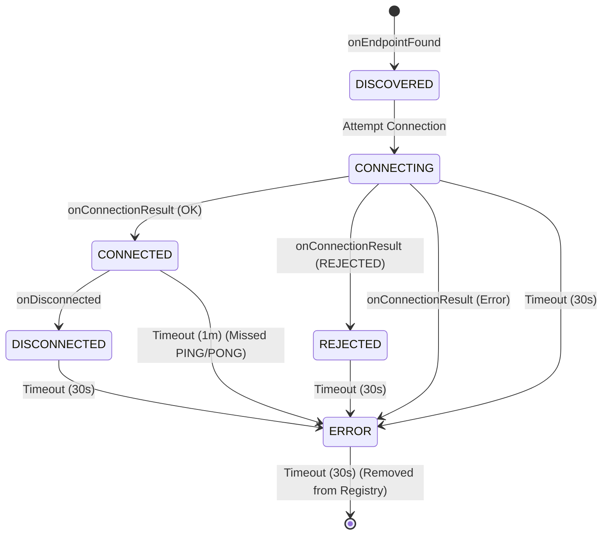

This is an Android application named "SimpleMesh" that tests device-to-device communication using
Google Play Services Nearby Connections API.

## Building and Running

The project uses Gradle as its build system.

NOTE: This app **CAN NOT RUN in the emulator**, the emulator doesn't support the Bluetooth stack.

NOTE: Instead, strongly consider running `deploy_all.sh` which builds the app, gets the list of
devices, and deploys, clears logcat, and runs on all connected devices.

* **Build the project:**
  ```bash
  ./gradlew build
  ```
* **Install and run the app on a connected device or emulator:**
  ```bash
  ./gradlew installDebug
  ```

Then launch the app from the device.

* **Run unit tests:** (none yet)
  ```bash
  ./gradlew test
  ```
* **Run instrumented tests:** (none yet)
  ```bash
  ./gradlew connectedAndroidTest
  ```

## Development Conventions

* **Language:** The project is written entirely in Kotlin.
* **UI:** The user interface is built with Jetpack Compose, which promotes a declarative and
  reactive programming style.
* **Architecture:** The project follows the standard Android application structure with a single
  `app` module.
* **Dependencies:** Key dependencies include:
    * Jetpack Compose for the UI.
    * Google Play Services Nearby for peer-to-peer connections.
    * AndroidX libraries for core functionality.


# Network State Flow & Lifecycle

This document outlines the lifecycle of nodes in the mesh, specifically focusing on the **Random "
Cockroach" Strategy**. It details how nodes connect, handle rejection, and how the network attempts
to merge partitions.

Code references are provided in brackets, e.g., `[File.kt :: functionName]`.

## 1. State Machine Reference

The `DeviceState` tracks the status of a remote peer. Transitions are triggered by API callbacks (
Found, Connected, Disconnected) or automatic Timeouts.

### Timeout Table

Defined in `ConnectionPhase.kt`.

| State            | Timeout  | Behavior on Timeout | Notes                                            |
|:-----------------|:---------|:--------------------|:-------------------------------------------------|
| **DISCOVERED**   | Infinite | None                | Stays visible until connected or lost.           |
| **CONNECTING**   | 30 sec   | -> **ERROR**        | Guards against stuck handshakes.                 |
| **CONNECTED**    | 1 min    | -> **ERROR**        | Liveness check (PING/PONG) failed.               |
| **DISCONNECTED** | 30 sec   | -> **ERROR**        | Grace period after disconnect.                   |
| **REJECTED**     | 30 sec   | -> **ERROR**        | Grace period after rejection.                    |
| **ERROR**        | 30 sec   | -> **Removed**      | Final cleanup. **Risk: Node becomes invisible.** |

### State Diagram



---

## 2. Scenario 1: Bootstrapping the Mesh (Happy Path)

**Actors:** NodeA (Empty), NodeB (Empty).
**Goal:** Form a 1-hop mesh.

1. **Start:** Both nodes start `NearbyConnectionsManager`. Discovery and Advertising begin.
    * `[NearbyConnectionsManager.kt :: startDiscovery]`
    * `[NearbyConnectionsManager.kt :: startAdvertising]`
2. **Discovery:**
    * NodeA finds NodeB. `onEndpointFound` fires.
      `[NearbyConnectionsManager.kt :: endpointDiscoveryCallback]`
    * NodeA Registry: NodeB is **DISCOVERED**. `[DevicesRegistry.kt :: updateDeviceStatus]`
    * NodeA Strategy: Adds NodeB to `potentialPeers`. `[DevicesRegistry.kt :: addPotentialPeer]`
3. **Selection:**
    * NodeA's `RandomConnectionStrategy` loop wakes up.
      `[RandomConnectionStrategy.kt :: manageConnectionsLoop]`
    * Checks capacity: 0/4 (OK).
    * Picks NodeB (randomly or by retry count). `[RandomConnectionStrategy.kt :: attemptToConnect]`
4. **Connection Request:**
    * NodeA updates NodeB state to **CONNECTING**. `[DevicesRegistry.kt :: updateDeviceStatus]`
    * NodeA calls `requestConnection("SimpleMesh", NodeB)`.
      `[RandomConnectionStrategy.kt :: connectToPeer]`
5. **Handshake:**
    * NodeB receives `onConnectionInitiated`.
      `[NearbyConnectionsManager.kt :: connectionLifecycleCallback]`
    * NodeB Strategy: Checks capacity 0/4 (OK). **Accepts** connection.
      `[RandomConnectionStrategy.kt :: onConnectionInitiated]`
    * NodeA receives `onConnectionInitiated`. **Accepts** connection.
6. **Success:**
    * Both receive `onConnectionResult(STATUS_OK)`.
      `[NearbyConnectionsManager.kt :: connectionLifecycleCallback]`
    * State updates to **CONNECTED**.
    * `DevicesRegistry` resets retry count for the peer. `[DevicesRegistry.kt :: resetRetryCount]`
7. **Liveness:**
    * NodeA immediately sends `PING` payload. `[NearbyConnectionsManager.kt :: connectedSendPing]`
    * NodeB receives `PING`. `[NearbyConnectionsManager.kt :: payloadCallback]`
    * NodeB updates state to **CONNECTED** (refreshing timeout).
      `[DevicesRegistry.kt :: updateDeviceStatus]`
    * NodeB replies `PONG`. `[NearbyConnectionsManager.kt :: payloadCallback]`
    * NodeA receives `PONG`, updates state, schedules next `PING` in 30s.

---

## 3. Scenario 2: Handling Rejection (Capacity Reached)

**Actors:** NodeA (Full, 4 peers), NodeE (Newcomer).
**Goal:** NodeE attempts to join but is rejected.

1. **Discovery:** NodeE finds NodeA. State: **DISCOVERED**.
   `[NearbyConnectionsManager.kt :: endpointDiscoveryCallback]`
2. **Attempt:** NodeE Strategy sees NodeA as a candidate. Updates to **CONNECTING** and requests
   connection. `[RandomConnectionStrategy.kt :: connectToPeer]`
3. **Rejection Logic:**
    * NodeA receives `onConnectionInitiated`.
      `[NearbyConnectionsManager.kt :: connectionLifecycleCallback]`
    * NodeA Strategy: Checks capacity. 4/4 (Full).
    * NodeA calls `rejectConnection`. `[RandomConnectionStrategy.kt :: onConnectionInitiated]`
    * NodeA logs warning: "Rejecting... Capacity Reached".
4. **Outcome for NodeE:**
    * NodeE receives `onConnectionResult(STATUS_CONNECTION_REJECTED)`.
      `[NearbyConnectionsManager.kt :: connectionLifecycleCallback]`
    * NodeE updates NodeA state to **REJECTED**. `[DevicesRegistry.kt :: updateDeviceStatus]`
    * **Retry Logic:** NodeE increments `retryCount` for NodeA (persisted by name).
      `[DevicesRegistry.kt :: incrementRetryCount]`
5. **The "Trap" (Wait Period):**
    * NodeE's `DeviceState` for NodeA is **REJECTED**.
    * NodeE waits 30 seconds (Timeout). `[DeviceState.kt :: startAutoTimeout]`
    * State becomes **ERROR**.
    * NodeE waits 30 seconds (Timeout).
    * State becomes **null** (Removed from Registry). `[DeviceState.kt :: startAutoTimeout]`
6. **Ghost Node Recovery:**
    * NodeA is removed from NodeE's `DevicesRegistry`. `[DevicesRegistry.kt :: remove]`
    * NodeE's `NearbyConnectionsManager` observes the removal via `DevicesRegistry.devices` flow.
      `[NearbyConnectionsManager.kt :: init]`
    * **Action:** NodeE triggers `stopDiscovery()` then `startDiscovery()`.
    * **Result:** The underlying API cache is flushed. If NodeA is still visible, `onEndpointFound`
      fires again.
    * NodeE re-discovers NodeA as **DISCOVERED**. Cycle repeats (but with backoff due to retry
      count).

---

## 4. Scenario 3: Split Brain & Island Merging

**Actors:** Cluster 1 (Nodes A, B, C, D - Full), Cluster 2 (Nodes E, F, G, H - Full).
**Goal:** The two clusters merge.

*Context: Both clusters are saturated (4 connections per node). Nodes in Cluster 1 can see Nodes in
Cluster 2, but cannot connect because they are full.*

1. **Stalemate:**
    * NodeA sees NodeE.
    * NodeA is full. Strategy skips `attemptToConnect`.
      `[RandomConnectionStrategy.kt :: manageConnectionsLoop]`
    * NodeE is full. Strategy skips `attemptToConnect`.
    * Network is partitioned (Split Brain).
2. **The "Cockroach" Island Breaker:**
    * NodeA's Strategy loop runs.
    * Condition: `activeConnections >= MAX_CONNECTIONS` (True).
      `[RandomConnectionStrategy.kt :: manageConnectionsLoop]`
    * Dice Roll: `Random.nextDouble() < 0.1` (10% chance).
      `[RandomConnectionStrategy.kt :: considerIslandBreaking]`
    * **Action:** NodeA disconnects a random peer (e.g., NodeD).
      `[ConnectionsClient.disconnectFromEndpoint]`
3. **Opening a Slot:**
    * NodeA state for NodeD -> **DISCONNECTED**. `[NearbyConnectionsManager.kt :: onDisconnected]`
    * NodeA active connections: 3/4.
4. **Merge Opportunity:**
    * Next Strategy loop (after ~5s). `[RandomConnectionStrategy.kt :: manageConnectionsLoop]`
    * NodeA capacity: 3/4 (Available).
    * NodeA sees NodeE in `potentialPeers` (DISCOVERED).
    * NodeA initiates connection to NodeE. `[RandomConnectionStrategy.kt :: connectToPeer]`
5. **Handshake (Half-Open):**
    * NodeE receives request.
    * **Risk:** If NodeE is still full (4/4), it will **REJECT** NodeA.
    * **Success:** If NodeE *also* ran its Island Breaker recently, or has a slot, it accepts.
6. **Stabilization:**
    * If connected, the islands are bridged.

---

## 5. Scenario 4: Error Recovery (The Zombie Node)

**Actors:** NodeA, NodeB.
**Event:** NodeB walks out of range or crashes without sending a disconnect frame.

1. **Silence:** NodeA is **CONNECTED** to NodeB.
2. **Liveness Check:**
    * NodeA sends `PING`. Fails (or sends into void).
      `[NearbyConnectionsManager.kt :: connectedSendPing]`
    * NodeB does not reply `PONG`.
3. **Timeout:**
    * NodeA's `DeviceState` timer (1 minute) expires. `[DeviceState.kt :: startAutoTimeout]`
    * Callback: `phaseOnTimeout` returns **ERROR**. `[ConnectionPhase.kt]`
    * NodeA updates NodeB state to **ERROR**.
4. **Cleanup:**
    * NodeA waits 30 seconds in **ERROR**.
    * Timeout expires. Returns `null`.
    * NodeA calls `DevicesRegistry.remove(NodeB)`. `[DevicesRegistry.kt :: remove]`
5. **Re-Discovery:**
    * NodeB is removed from internal maps.
    * NodeA's manager observes removal. `[NearbyConnectionsManager.kt :: init]`
    * **Action:** NodeA restarts Discovery.
    * **Result:** If NodeB comes back online or moves back in range, it is re-discovered fresh.

---

## 6. Scenario 5: Atomic Connection Failure

**Actors:** NodeA, NodeB.
**Event:** NodeA tries to connect, but the request fails immediately (e.g., radio busy, internal
error).

1. **Attempt:** NodeA calls `requestConnection`. `[RandomConnectionStrategy.kt :: connectToPeer]`
2. **Immediate Failure:** The API call fails before the handshake starts.
    * The `addOnFailureListener` block executes.
3. **Fail Fast:**
    * NodeA immediately updates NodeB state to **ERROR**.
      `[RandomConnectionStrategy.kt :: connectToPeer]`
    * *Previously, this would wait 30s in CONNECTING.*
4. **Cleanup:**
    * NodeB enters **ERROR** state (30s timeout).
    * Timeout expires -> Removed.
    * Removal triggers **Restart Discovery** (Scenario 2/4).

---

## 7. Resolved Gaps (Formerly "Gap Analysis")

The following gaps were identified and have been resolved in the codebase:

1. **The "Ghost Node" Problem (Resolved):**
    * **Issue:** Removal of a device from the registry left the Nearby Connections stack unaware,
      preventing re-discovery.
    * **Fix:** `NearbyConnectionsManager` now observes the `DevicesRegistry` flow. When a device
      removal is detected, it triggers a `stopDiscovery` / `startDiscovery` cycle to flush the
      stack's cache and ensure the node is re-discovered if still present.

2. **Atomic Connection Failure (Resolved):**
    * **Issue:** Immediate API failures left the device in `CONNECTING` state until the 30s timeout.
    * **Fix:** The `requestConnection` failure listener now explicitly transitions the device to
      `ERROR` immediately, ensuring the failure is handled promptly and the slot is eventually freed
      up (after the ERROR grace period).


# SimpleMesh Refactoring & Hardening Plan ("The 25% Better")

This document outlines a focused effort to improve the stability, architecture, and testability of
the SimpleMesh application without increasing feature scope.

## 1. Robustness & Lifecycle (Critical Fixes)

### 1.1 Fix Activity Lifecycle Leak

**Severity:** Critical
**Problem:**
`NearbyConnectionsManager` is currently initialized in `MainActivity` using `lifecycleScope`. When
the screen rotates or the Activity is recreated:

1. `lifecycleScope` is cancelled.
2. The `externalScope` inside `NearbyConnectionsManager` becomes cancelled.
3. All background P2P operations (discovery, advertising, heartbeats) silently stop, even though the
   `MainViewModel` (which holds the manager) survives.

**Proposed Solution:**

* Decouple `NearbyConnectionsManager` scope from `MainActivity`.
* Inject a scope that survives configuration changes, such as `applicationScope` (created in the
  Application class) or use `viewModelScope` if the manager's lifecycle is strictly tied to the
  ViewModel. Given the "always-on" nature of P2P, an application-level scope is preferred to prevent
  accidental cancellations.

### 1.2 Fix Packet Cache Memory Leak

**Severity:** High
**Problem:**
`seenPackets` is implemented as a `ConcurrentHashMap.newKeySet<String>()`. It grows indefinitely as
new packets are received. In a long-running mesh, this will eventually cause an `OutOfMemoryError`.

**Proposed Solution:**

* Refactor `seenPackets` to a `Map<String, Long>` (PacketID -> Timestamp).
* Implement a `cleanupJob` that runs periodically (e.g., every 1 minute).
* **Logic:** Remove entries older than **10 minutes** (TTL).

## 2. Architecture (Separation of Concerns)

### 2.1 Extract `PacketRouter`

**Severity:** Medium
**Problem:**
`NearbyConnectionsManager` violates the Single Responsibility Principle. It currently handles:

1. Google Nearby Connections API (Hardware/Transport).
2. Packet Serialization (CBOR).
3. Deduplication Logic (`seenPackets`).
4. Flooding Logic (TTL check, rebroadcast).

**Proposed Solution:**
Extract a pure Kotlin class `PacketRouter`.

* **Responsibilities:** Packet validation, deduplication, TTL management, and deciding *what* to
  broadcast.
* **Interface:** `NearbyConnectionsManager` passes raw byte arrays to `PacketRouter`. `PacketRouter`
  returns a result (e.g., `ShouldForward(bytes)` or `Drop`).
* **Benefit:** This isolates the complex routing logic from the Android API, making it
  unit-testable (see Section 3).

## 3. Confidence (Testing)

### 3.1 Logic Unit Tests

**Severity:** Medium
**Problem:**
The project currently relies on manual testing because instrumented tests cannot run on the
emulator (missing Bluetooth). Logic bugs are hard to catch.

**Proposed Solution:**
Add JUnit tests for components that *do not* require the Android Bluetooth stack.

* **`PacketRouterTest`:**
    * Verify a packet is marked as seen.
    * Verify duplicate packets are rejected.
    * Verify TTL is decremented.
    * Verify packets with TTL=0 are dropped.
    * Verify cache cleanup removes old entries.
* **`MeshPacketTest`:**
    * Verify CBOR encoding/decoding correctness.
    * Verify handling of large payloads.

## 4. Documentation

### 4.1 Cleanup `BUGS.md`

**Problem:**
The bug tracker contains outdated information.

* "Broadcast Flood (No Loop Prevention)" is listed, but the code already implements `MeshPacket`
  with UUID and TTL.
* "Activity Leak" is listed and will be addressed by Step 1.1.

**Proposed Solution:**

* Audit `BUGS.md` and remove fixed or obsolete issues.
* Update `README.md` to reflect the new `PacketRouter` architecture.


# REPLY: Analysis of SimpleMesh Project Feasibility

## Executive Summary

**Verdict: Yes, this project is feasible for sending small, infrequent commands.**

The current implementation of the SimpleMesh application demonstrates a sophisticated understanding
of the limitations of the Google Nearby Connections API and successfully implements several key
features required for a robust, multi-hop mesh network. While the `CHALLENGES.md` document correctly
identifies the theoretical hurdles of building a 30-node mesh network, the SimpleMesh project has
implemented sufficient workarounds to make it a viable platform for its intended purpose.

The project's success hinges on its application-layer protocol, which transforms the Nearby
Connections API's simple, 1-hop connections into a true mesh network. The key features that enable
this are:

* **Application-Layer Routing:** The custom `MeshPayload` and flooding mechanism allow messages to
  traverse the network beyond the 1-hop limitation of the API.
* **Sparse Graph Topology:** By limiting the number of concurrent connections, the application
  avoids the "connection flood" that can destabilize the network.
* **Partition Recovery:** The PING/PONG heartbeat and connection rotation mechanisms provide a solid
  foundation for detecting and healing network partitions.

However, the project is not yet "production-ready." There are several "speedbumps" that need to be
addressed to ensure the network is reliable and resilient. These are outlined in the "Roadmap to
Success" section below.

## Challenge Analysis

This section analyzes the key challenges identified in `CHALLENGES.md` and assesses how the
SimpleMesh project addresses them.

### 1. Architecture and Topology: P2P_CLUSTER vs. Scatternets

* **Challenge:** The `P2P_CLUSTER` strategy in Nearby Connections is a "black box" that doesn't
  provide the granular control needed for a 30-node mesh.
* **Assessment:** **Covered.** The SimpleMesh project effectively works around this by building its
  own topology management on top of the API. The "Connection Slot Manager" and "Sparse Graph
  Topology" are direct solutions to this problem.

### 2. Engineering Effort and Complexity

* **Challenge:** Building a custom mesh protocol is a massive undertaking.
* **Assessment:** **Covered.** The project has already implemented the core components of a custom
  mesh protocol, including a routing engine, a topology manager, and a liveness manager. While there
  is still work to be done, the foundational pieces are in place.

### 3. Island Joining

* **Challenge:** Merging two disconnected network partitions is a complex algorithmic problem.
* **Assessment:** **A Good Thing to Cover in Upcoming Features.** The current implementation has a
  basic gossip protocol for topology discovery, but it does not have a robust mechanism for merging
  two large, distinct network partitions. The current implementation is susceptible to "broadcast
  storms" and "split-brain" scenarios.

### 4. Cluster Repair and Self-Healing

* **Challenge:** The network must be able to automatically repair itself when nodes join or leave.
* **Assessment:** **A Good Thing to Cover in Upcoming Features.** The PING/PONG liveness check is a
  good start, but the network would benefit from a more sophisticated "Healing Service" that can
  proactively identify and repair partitions.

### 5. Bandwidth Trade-offs

* **Challenge:** Nearby Connections does not provide high bandwidth in a mesh topology, and raw
  Bluetooth is slow.
* **Assessment:** **Covered.** The project's focus on "small, infrequent commands" aligns perfectly
  with the low-bandwidth nature of the underlying transport. The application is designed to conserve
  bandwidth by using small payloads and avoiding streams.

### 6. Cross-Platform Interoperability (Android & iOS)

* **Challenge:** True offline mesh networking between Android and iOS is nearly impossible with
  Nearby Connections.
* **Assessment:** **Impossible to Code Around.** As you noted, this is a fundamental limitation of
  the underlying platforms. The project is wisely focused on an Android-only implementation.

## Roadmap to Success

The following is a list of the key "speedbumps" that lie between the current implementation and a
fully robust and reliable mesh network.

1. **Implement a Robust Island Joining Protocol:**
    * **Problem:** The current gossip protocol is not sufficient to handle the merging of two large
      network partitions.
    * **Solution:** Implement a more sophisticated protocol for state reconciliation, such as
      Conflict-free Replicated Data Types (CRDTs) or a Merkle-DAG sync. This will prevent "
      split-brain" scenarios and ensure that all nodes converge to a consistent view of the network.

2. **Enhance the Healing Service:**
    * **Problem:** The current healing mechanism is reactive (based on PING/PONG timeouts).
    * **Solution:** Implement a proactive healing service that periodically assesses the health of
      the network and takes action to prevent partitions before they occur. This could involve
      forcing connection rotation or creating redundant links.

3. **Add Source Routing for Unicast Messages:**
    * **Problem:** The current flooding mechanism is inefficient for sending messages to a specific
      node.
    * **Solution:** Implement a source-routing mechanism that allows a node to specify the exact
      path a message should take through the network. This will reduce network congestion and
      improve message delivery times.

4. **Improve the Connection Slot Manager:**
    * **Problem:** The current connection slot manager is based on a simple "first-come,
      first-served" algorithm.
    * **Solution:** Enhance the connection slot manager to make more intelligent decisions about
      which peers to connect to. This could be based on factors such as link quality (RSSI), battery
      level, or the node's position in the network graph.

By addressing these four areas, the SimpleMesh project can evolve from a promising prototype into a
truly resilient and reliable communication platform.
