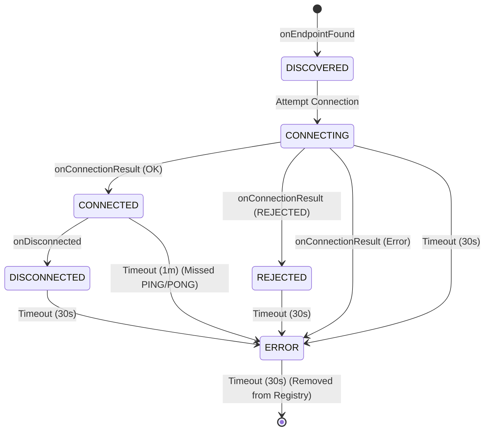

# Network State Flow & Lifecycle

This document outlines the lifecycle of nodes in the mesh, specifically focusing on the **Random "Cockroach" Strategy**. It details how nodes connect, handle rejection, and how the network attempts to merge partitions.

Code references are provided in brackets, e.g., `[File.kt :: functionName]`.

## 1. State Machine Reference

The `DeviceState` tracks the status of a remote peer. Transitions are triggered by API callbacks (Found, Connected, Disconnected) or automatic Timeouts.

### Timeout Table
Defined in `ConnectionPhase.kt`.

| State | Timeout | Behavior on Timeout | Notes |
| :--- | :--- | :--- | :--- |
| **DISCOVERED** | Infinite | None | Stays visible until connected or lost. |
| **CONNECTING** | 30 sec | -> **ERROR** | Guards against stuck handshakes. |
| **CONNECTED** | 1 min | -> **ERROR** | Liveness check (PING/PONG) failed. |
| **DISCONNECTED** | 30 sec | -> **ERROR** | Grace period after disconnect. |
| **REJECTED** | 30 sec | -> **ERROR** | Grace period after rejection. |
| **ERROR** | 30 sec | -> **Removed** | Final cleanup. **Risk: Node becomes invisible.** |

### State Diagram

---

## 2. Scenario 1: Bootstrapping the Mesh (Happy Path)

**Actors:** NodeA (Empty), NodeB (Empty).
**Goal:** Form a 1-hop mesh.

1.  **Start:** Both nodes start `NearbyConnectionsManager`. Discovery and Advertising begin.
    *   `[NearbyConnectionsManager.kt :: startDiscovery]`
    *   `[NearbyConnectionsManager.kt :: startAdvertising]`
2.  **Discovery:**
    *   NodeA finds NodeB. `onEndpointFound` fires. `[NearbyConnectionsManager.kt :: endpointDiscoveryCallback]`
    *   NodeA Registry: NodeB is **DISCOVERED**. `[DevicesRegistry.kt :: updateDeviceStatus]`
    *   NodeA Strategy: Adds NodeB to `potentialPeers`. `[DevicesRegistry.kt :: addPotentialPeer]`
3.  **Selection:**
    *   NodeA's `RandomConnectionStrategy` loop wakes up. `[RandomConnectionStrategy.kt :: manageConnectionsLoop]`
    *   Checks capacity: 0/4 (OK).
    *   Picks NodeB (randomly or by retry count). `[RandomConnectionStrategy.kt :: attemptToConnect]`
4.  **Connection Request:**
    *   NodeA updates NodeB state to **CONNECTING**. `[DevicesRegistry.kt :: updateDeviceStatus]`
    *   NodeA calls `requestConnection("SimpleMesh", NodeB)`. `[RandomConnectionStrategy.kt :: connectToPeer]`
5.  **Handshake:**
    *   NodeB receives `onConnectionInitiated`. `[NearbyConnectionsManager.kt :: connectionLifecycleCallback]`
    *   NodeB Strategy: Checks capacity 0/4 (OK). **Accepts** connection. `[RandomConnectionStrategy.kt :: onConnectionInitiated]`
    *   NodeA receives `onConnectionInitiated`. **Accepts** connection.
6.  **Success:**
    *   Both receive `onConnectionResult(STATUS_OK)`. `[NearbyConnectionsManager.kt :: connectionLifecycleCallback]`
    *   State updates to **CONNECTED**.
    *   `DevicesRegistry` resets retry count for the peer. `[DevicesRegistry.kt :: resetRetryCount]`
7.  **Liveness:**
    *   NodeA immediately sends `PING` payload. `[NearbyConnectionsManager.kt :: connectedSendPing]`
    *   NodeB receives `PING`. `[NearbyConnectionsManager.kt :: payloadCallback]`
    *   NodeB updates state to **CONNECTED** (refreshing timeout). `[DevicesRegistry.kt :: updateDeviceStatus]`
    *   NodeB replies `PONG`. `[NearbyConnectionsManager.kt :: payloadCallback]`
    *   NodeA receives `PONG`, updates state, schedules next `PING` in 30s.

---

## 3. Scenario 2: Handling Rejection (Capacity Reached)

**Actors:** NodeA (Full, 4 peers), NodeE (Newcomer).
**Goal:** NodeE attempts to join but is rejected.

1.  **Discovery:** NodeE finds NodeA. State: **DISCOVERED**. `[NearbyConnectionsManager.kt :: endpointDiscoveryCallback]`
2.  **Attempt:** NodeE Strategy sees NodeA as a candidate. Updates to **CONNECTING** and requests connection. `[RandomConnectionStrategy.kt :: connectToPeer]`
3.  **Rejection Logic:**
    *   NodeA receives `onConnectionInitiated`. `[NearbyConnectionsManager.kt :: connectionLifecycleCallback]`
    *   NodeA Strategy: Checks capacity. 4/4 (Full).
    *   NodeA calls `rejectConnection`. `[RandomConnectionStrategy.kt :: onConnectionInitiated]`
    *   NodeA logs warning: "Rejecting... Capacity Reached".
4.  **Outcome for NodeE:**
    *   NodeE receives `onConnectionResult(STATUS_CONNECTION_REJECTED)`. `[NearbyConnectionsManager.kt :: connectionLifecycleCallback]`
    *   NodeE updates NodeA state to **REJECTED**. `[DevicesRegistry.kt :: updateDeviceStatus]`
    *   **Retry Logic:** NodeE increments `retryCount` for NodeA (persisted by name). `[DevicesRegistry.kt :: incrementRetryCount]`
5.  **The "Trap" (Wait Period):**
    *   NodeE's `DeviceState` for NodeA is **REJECTED**.
    *   NodeE waits 30 seconds (Timeout). `[DeviceState.kt :: startAutoTimeout]`
    *   State becomes **ERROR**.
    *   NodeE waits 30 seconds (Timeout).
    *   State becomes **null** (Removed from Registry). `[DeviceState.kt :: startAutoTimeout]`
6.  **Ghost Node Recovery:**
    *   NodeA is removed from NodeE's `DevicesRegistry`. `[DevicesRegistry.kt :: remove]`
    *   NodeE's `NearbyConnectionsManager` observes the removal via `DevicesRegistry.devices` flow. `[NearbyConnectionsManager.kt :: init]`
    *   **Action:** NodeE triggers `stopDiscovery()` then `startDiscovery()`.
    *   **Result:** The underlying API cache is flushed. If NodeA is still visible, `onEndpointFound` fires again.
    *   NodeE re-discovers NodeA as **DISCOVERED**. Cycle repeats (but with backoff due to retry count).

---

## 4. Scenario 3: Split Brain & Island Merging

**Actors:** Cluster 1 (Nodes A, B, C, D - Full), Cluster 2 (Nodes E, F, G, H - Full).
**Goal:** The two clusters merge.

*Context: Both clusters are saturated (4 connections per node). Nodes in Cluster 1 can see Nodes in Cluster 2, but cannot connect because they are full.*

1.  **Stalemate:**
    *   NodeA sees NodeE.
    *   NodeA is full. Strategy skips `attemptToConnect`. `[RandomConnectionStrategy.kt :: manageConnectionsLoop]`
    *   NodeE is full. Strategy skips `attemptToConnect`.
    *   Network is partitioned (Split Brain).
2.  **The "Cockroach" Island Breaker:**
    *   NodeA's Strategy loop runs.
    *   Condition: `activeConnections >= MAX_CONNECTIONS` (True). `[RandomConnectionStrategy.kt :: manageConnectionsLoop]`
    *   Dice Roll: `Random.nextDouble() < 0.1` (10% chance). `[RandomConnectionStrategy.kt :: considerIslandBreaking]`
    *   **Action:** NodeA disconnects a random peer (e.g., NodeD). `[ConnectionsClient.disconnectFromEndpoint]`
3.  **Opening a Slot:**
    *   NodeA state for NodeD -> **DISCONNECTED**. `[NearbyConnectionsManager.kt :: onDisconnected]`
    *   NodeA active connections: 3/4.
4.  **Merge Opportunity:**
    *   Next Strategy loop (after ~5s). `[RandomConnectionStrategy.kt :: manageConnectionsLoop]`
    *   NodeA capacity: 3/4 (Available).
    *   NodeA sees NodeE in `potentialPeers` (DISCOVERED).
    *   NodeA initiates connection to NodeE. `[RandomConnectionStrategy.kt :: connectToPeer]`
5.  **Handshake (Half-Open):**
    *   NodeE receives request.
    *   **Risk:** If NodeE is still full (4/4), it will **REJECT** NodeA.
    *   **Success:** If NodeE *also* ran its Island Breaker recently, or has a slot, it accepts.
6.  **Stabilization:**
    *   If connected, the islands are bridged.

---

## 5. Scenario 4: Error Recovery (The Zombie Node)

**Actors:** NodeA, NodeB.
**Event:** NodeB walks out of range or crashes without sending a disconnect frame.

1.  **Silence:** NodeA is **CONNECTED** to NodeB.
2.  **Liveness Check:**
    *   NodeA sends `PING`. Fails (or sends into void). `[NearbyConnectionsManager.kt :: connectedSendPing]`
    *   NodeB does not reply `PONG`.
3.  **Timeout:**
    *   NodeA's `DeviceState` timer (1 minute) expires. `[DeviceState.kt :: startAutoTimeout]`
    *   Callback: `phaseOnTimeout` returns **ERROR**. `[ConnectionPhase.kt]`
    *   NodeA updates NodeB state to **ERROR**.
4.  **Cleanup:**
    *   NodeA waits 30 seconds in **ERROR**.
    *   Timeout expires. Returns `null`.
    *   NodeA calls `DevicesRegistry.remove(NodeB)`. `[DevicesRegistry.kt :: remove]`
5.  **Re-Discovery:**
    *   NodeB is removed from internal maps.
    *   NodeA's manager observes removal. `[NearbyConnectionsManager.kt :: init]`
    *   **Action:** NodeA restarts Discovery.
    *   **Result:** If NodeB comes back online or moves back in range, it is re-discovered fresh.

---

## 6. Scenario 5: Atomic Connection Failure

**Actors:** NodeA, NodeB.
**Event:** NodeA tries to connect, but the request fails immediately (e.g., radio busy, internal error).

1.  **Attempt:** NodeA calls `requestConnection`. `[RandomConnectionStrategy.kt :: connectToPeer]`
2.  **Immediate Failure:** The API call fails before the handshake starts.
    *   The `addOnFailureListener` block executes.
3.  **Fail Fast:**
    *   NodeA immediately updates NodeB state to **ERROR**. `[RandomConnectionStrategy.kt :: connectToPeer]`
    *   *Previously, this would wait 30s in CONNECTING.*
4.  **Cleanup:**
    *   NodeB enters **ERROR** state (30s timeout).
    *   Timeout expires -> Removed.
    *   Removal triggers **Restart Discovery** (Scenario 2/4).

---

## 7. Resolved Gaps (Formerly "Gap Analysis")

The following gaps were identified and have been resolved in the codebase:

1.  **The "Ghost Node" Problem (Resolved):**
    *   **Issue:** Removal of a device from the registry left the Nearby Connections stack unaware, preventing re-discovery.
    *   **Fix:** `NearbyConnectionsManager` now observes the `DevicesRegistry` flow. When a device removal is detected, it triggers a `stopDiscovery` / `startDiscovery` cycle to flush the stack's cache and ensure the node is re-discovered if still present.

2.  **Atomic Connection Failure (Resolved):**
    *   **Issue:** Immediate API failures left the device in `CONNECTING` state until the 30s timeout.
    *   **Fix:** The `requestConnection` failure listener now explicitly transitions the device to `ERROR` immediately, ensuring the failure is handled promptly and the slot is eventually freed up (after the ERROR grace period).
