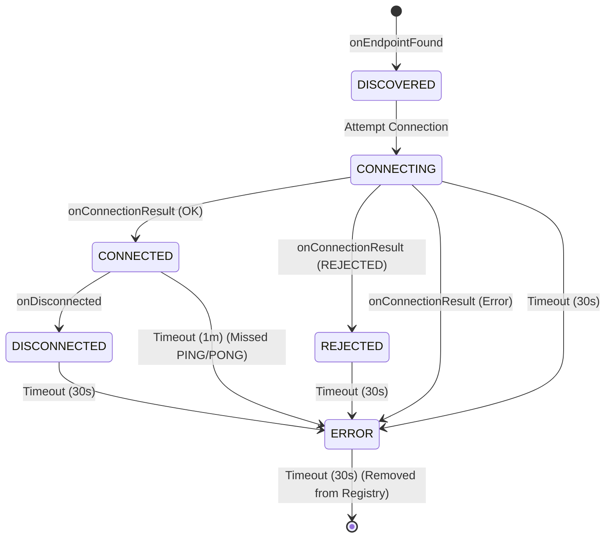

# Network State Flow & Lifecycle

This document outlines the lifecycle of nodes in the mesh, specifically focusing on the **Random "Cockroach" Strategy**. It details how nodes connect, handle rejection, and how the network attempts to merge partitions.

Code references are provided in brackets, e.g., `[File.kt :: functionName]`.

## 1. State Machine Reference

The `DeviceState` tracks the status of a remote peer. Transitions are triggered by API callbacks (Found, Connected, Disconnected) or automatic Timeouts.

### Timeout Table
Defined in `ConnectionPhase.kt`.

| State | Timeout | Behavior on Timeout | Notes |
| :--- | :--- | :--- | :--- |
| **DISCOVERED** | Infinite | None | Stays visible until connected or lost. |
| **CONNECTING** | 30 sec | -> **ERROR** | Guards against stuck handshakes. |
| **CONNECTED** | 1 min | -> **ERROR** | Liveness check (PING/PONG) failed. |
| **DISCONNECTED** | 30 sec | -> **ERROR** | Grace period after disconnect. |
| **REJECTED** | 30 sec | -> **ERROR** | Grace period after rejection. |
| **ERROR** | 30 sec | -> **Removed** | Final cleanup. **Risk: Node becomes invisible.** |

### State Diagram

---

## 2. Scenario 1: Bootstrapping the Mesh (Happy Path)

**Actors:** NodeA (Empty), NodeB (Empty).
**Goal:** Form a 1-hop mesh.

1.  **Start:** Both nodes start `NearbyConnectionsManager`. Discovery and Advertising begin.
    *   `[NearbyConnectionsManager.kt :: startDiscovery]`
    *   `[NearbyConnectionsManager.kt :: startAdvertising]`
2.  **Discovery:**
    *   NodeA finds NodeB. `onEndpointFound` fires. `[NearbyConnectionsManager.kt :: endpointDiscoveryCallback]`
    *   NodeA Registry: NodeB is **DISCOVERED**. `[DevicesRegistry.kt :: updateDeviceStatus]`
    *   NodeA Strategy: Adds NodeB to `potentialPeers`. `[DevicesRegistry.kt :: addPotentialPeer]`
3.  **Selection:**
    *   NodeA's `RandomConnectionStrategy` loop wakes up. `[RandomConnectionStrategy.kt :: manageConnectionsLoop]`
    *   Checks capacity: 0/4 (OK).
    *   Picks NodeB (randomly or by retry count). `[RandomConnectionStrategy.kt :: attemptToConnect]`
4.  **Connection Request:**
    *   NodeA updates NodeB state to **CONNECTING**. `[DevicesRegistry.kt :: updateDeviceStatus]`
    *   NodeA calls `requestConnection("SimpleMesh", NodeB)`. `[RandomConnectionStrategy.kt :: connectToPeer]`
5.  **Handshake:**
    *   NodeB receives `onConnectionInitiated`. `[NearbyConnectionsManager.kt :: connectionLifecycleCallback]`
    *   NodeB Strategy: Checks capacity 0/4 (OK). **Accepts** connection. `[RandomConnectionStrategy.kt :: onConnectionInitiated]`
    *   NodeA receives `onConnectionInitiated`. **Accepts** connection.
6.  **Success:**
    *   Both receive `onConnectionResult(STATUS_OK)`. `[NearbyConnectionsManager.kt :: connectionLifecycleCallback]`
    *   State updates to **CONNECTED**.
    *   `DevicesRegistry` resets retry count for the peer. `[DevicesRegistry.kt :: resetRetryCount]`
7.  **Liveness:**
    *   NodeA immediately sends `PING` payload. `[NearbyConnectionsManager.kt :: connectedSendPing]`
    *   NodeB receives `PING`. `[NearbyConnectionsManager.kt :: payloadCallback]`
    *   NodeB updates state to **CONNECTED** (refreshing timeout). `[DevicesRegistry.kt :: updateDeviceStatus]`
    *   NodeB replies `PONG`. `[NearbyConnectionsManager.kt :: payloadCallback]`
    *   NodeA receives `PONG`, updates state, schedules next `PING` in 30s.

---

## 3. Scenario 2: Handling Rejection (Capacity Reached)

**Actors:** NodeA (Full, 4 peers), NodeE (Newcomer).
**Goal:** NodeE attempts to join but is rejected.

1.  **Discovery:** NodeE finds NodeA. State: **DISCOVERED**. `[NearbyConnectionsManager.kt :: endpointDiscoveryCallback]`
2.  **Attempt:** NodeE Strategy sees NodeA as a candidate. Updates to **CONNECTING** and requests connection. `[RandomConnectionStrategy.kt :: connectToPeer]`
3.  **Rejection Logic:**
    *   NodeA receives `onConnectionInitiated`. `[NearbyConnectionsManager.kt :: connectionLifecycleCallback]`
    *   NodeA Strategy: Checks capacity. 4/4 (Full).
    *   NodeA calls `rejectConnection`. `[RandomConnectionStrategy.kt :: onConnectionInitiated]`
    *   NodeA logs warning: "Rejecting... Capacity Reached".
4.  **Outcome for NodeE:**
    *   NodeE receives `onConnectionResult(STATUS_CONNECTION_REJECTED)`. `[NearbyConnectionsManager.kt :: connectionLifecycleCallback]`
    *   NodeE updates NodeA state to **REJECTED**. `[DevicesRegistry.kt :: updateDeviceStatus]`
    *   **Retry Logic:** NodeE increments `retryCount` for NodeA (persisted by name). `[DevicesRegistry.kt :: incrementRetryCount]`
5.  **The "Trap" (Wait Period):**
    *   NodeE's `DeviceState` for NodeA is **REJECTED**.
    *   NodeE waits 30 seconds (Timeout). `[DeviceState.kt :: startAutoTimeout]`
    *   State becomes **ERROR**.
    *   NodeE waits 30 seconds (Timeout).
    *   State becomes **null** (Removed from Registry). `[DeviceState.kt :: startAutoTimeout]`
6.  **The "Ghost Node" Risk:**
    *   NodeA is now removed from NodeE's `DevicesRegistry`. `[DevicesRegistry.kt :: remove]`
    *   **Gap Identified:** Since NodeA is likely still advertising, the underlying Google Nearby stack *knows* about it but has already delivered `onEndpointFound`. NodeE's app layer has forgotten NodeA, but the API layer won't tell us about it again.

---

## 4. Scenario 3: Split Brain & Island Merging

**Actors:** Cluster 1 (Nodes A, B, C, D - Full), Cluster 2 (Nodes E, F, G, H - Full).
**Goal:** The two clusters merge.

*Context: Both clusters are saturated (4 connections per node). Nodes in Cluster 1 can see Nodes in Cluster 2, but cannot connect because they are full.*

1.  **Stalemate:**
    *   NodeA sees NodeE.
    *   NodeA is full. Strategy skips `attemptToConnect`. `[RandomConnectionStrategy.kt :: manageConnectionsLoop]`
    *   NodeE is full. Strategy skips `attemptToConnect`.
    *   Network is partitioned (Split Brain).
2.  **The "Cockroach" Island Breaker:**
    *   NodeA's Strategy loop runs.
    *   Condition: `activeConnections >= MAX_CONNECTIONS` (True). `[RandomConnectionStrategy.kt :: manageConnectionsLoop]`
    *   Dice Roll: `Random.nextDouble() < 0.1` (10% chance). `[RandomConnectionStrategy.kt :: considerIslandBreaking]`
    *   **Action:** NodeA disconnects a random peer (e.g., NodeD). `[ConnectionsClient.disconnectFromEndpoint]`
3.  **Opening a Slot:**
    *   NodeA state for NodeD -> **DISCONNECTED**. `[NearbyConnectionsManager.kt :: onDisconnected]`
    *   NodeA active connections: 3/4.
4.  **Merge Opportunity:**
    *   Next Strategy loop (after ~5s). `[RandomConnectionStrategy.kt :: manageConnectionsLoop]`
    *   NodeA capacity: 3/4 (Available).
    *   NodeA sees NodeE in `potentialPeers` (DISCOVERED).
    *   NodeA initiates connection to NodeE. `[RandomConnectionStrategy.kt :: connectToPeer]`
5.  **Handshake (Half-Open):**
    *   NodeE receives request.
    *   **Risk:** If NodeE is still full (4/4), it will **REJECT** NodeA.
    *   **Success:** If NodeE *also* ran its Island Breaker recently, or has a slot, it accepts.
6.  **Stabilization:**
    *   If connected, the islands are bridged.

---

## 5. Scenario 4: Error Recovery (The Zombie Node)

**Actors:** NodeA, NodeB.
**Event:** NodeB walks out of range or crashes without sending a disconnect frame.

1.  **Silence:** NodeA is **CONNECTED** to NodeB.
2.  **Liveness Check:**
    *   NodeA sends `PING`. Fails (or sends into void). `[NearbyConnectionsManager.kt :: connectedSendPing]`
    *   NodeB does not reply `PONG`.
3.  **Timeout:**
    *   NodeA's `DeviceState` timer (1 minute) expires. `[DeviceState.kt :: startAutoTimeout]`
    *   Callback: `phaseOnTimeout` returns **ERROR**. `[ConnectionPhase.kt]`
    *   NodeA updates NodeB state to **ERROR**.
4.  **Cleanup:**
    *   NodeA waits 30 seconds in **ERROR**.
    *   Timeout expires. Returns `null`.
    *   NodeA calls `DevicesRegistry.remove(NodeB)`. `[DevicesRegistry.kt :: remove]`
5.  **Re-Discovery:**
    *   NodeB is removed from internal maps.
    *   **Gap Identified:** Similar to the Ghost Node, if NodeB comes back with the *same* endpointId (unlikely after crash, but possible with range fluctuation), we might not get a new `onEndpointFound` unless discovery restarts.

---

## 6. Gap Analysis (Found Misses)

The following logic gaps were identified during the flow analysis:

1.  **The "Ghost Node" Problem (Re-Discovery Failure):**
    *   **Issue:** When a node transitions to `ERROR` and is subsequently removed from `DevicesRegistry` (Scenario 2, Step 6 and Scenario 4, Step 5), the application layer "forgets" the endpoint. However, the Google Nearby Connections API stack still maintains the endpoint in its cache and will not re-fire `onEndpointFound`.
    *   **Result:** The node becomes invisible to the application until the discovery process is explicitly restarted (`stopDiscovery` -> `startDiscovery`).
    *   **Missing Code:** `DevicesRegistry.remove` triggers no action in `NearbyConnectionsManager`. There is no logic to "flush" or restart discovery upon losing a node.

2.  **Atomic Connection Failure Handling:**
    *   **Issue:** In `RandomConnectionStrategy.connectToPeer`, if `connectionsClient.requestConnection` fails immediately (the `addOnFailureListener` block), the device status remains in `CONNECTING` until the 30-second timeout cleans it up.
    *   **Result:** The slot is "held" for 30 seconds unnecessarily.
    *   **Missing Code:** The failure listener should probably trigger an immediate transition to `ERROR` or `DISCONNECTED` to free up the slot faster.
